# Tutorial: Introducción a la ciencia de redes con R e igraph

En este tutorial, cubriremos los conceptos básicos de Network Science con `R` y el paquete `igraph`. Exploraremos los fundamentos de las redes, incluida la estructura y la dinámica de la red. 

# Introducción a Redes Complejas y Teoría de Grafos

Las redes complejas son sistemas compuestos por muchos elementos interconectados. Se encuentran en muchos sistemas naturales y artificiales, como Internet, redes sociales, redes celulares y redes de transporte. La teoría de grafos es la herramienta matemática utilizada para estudiar y analizar redes complejas. Los grafos están compuestos por nodos y aristas, que representan los elementos y conexiones de la red. La teoría de grafos permite el análisis de la estructura, la dinámica y la evolución de la red.

# Elementos de una Red: Nodos y Aristas

En la teoría de grafos, una red se representa como un grafo, que se compone de nodos (también conocidos como vértices) y enlaces (también llamados bordes o aristas).  
Los nodos representan los elementos de la red, como personas en una red social o ciudades en una red de transporte. Los bordes representan las conexiones entre nodos, como las relaciones entre personas o carreteras que conectan ciudades.

# Cargando igraph y creando una primera red

::: {.cell}

```{.r .cell-code}
# Cargando igraph
library(igraph)
# Creando una primera red simple mediante fórmula
net <- graph.formula(A--B, B--C, C--D, D--E, E--F, F--G, G--A)
# Imprimiendo el output de la red en igraph:
net
```

::: {.cell-output .cell-output-stdout}
```
IGRAPH fd3c7ed UN-- 7 7 -- 
+ attr: name (v/c)
+ edges from fd3c7ed (vertex names):
[1] A--B A--G B--C C--D D--E E--F F--G
```
:::
:::

Es posible también crear una red vacía y luego ir llenándola con nodos y enlaces


::: {.cell}

```{.r .cell-code}
# Crear un grafo de red vacío
g <- graph.empty() 

# Agregar vértices al grafo
g <- add.vertices(g, 5) 

# Agregar links al grafo
g <- add.edges(g, c(1,2, 1,3, 1,4, 1,5)) 
```
:::


El paquete `igraph` tiene un módulo para graficar que está escrito sobre el paquete `plot` del base `R`. Por lo tanto, podemos obtener rápidamente una visualización de estas redes.


::: {.cell}

```{.r .cell-code}
plot(net)
```

::: {.cell-output-display}
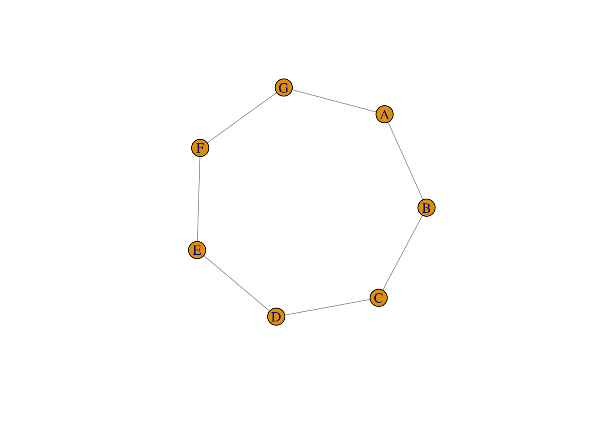{width=672}
:::
:::

::: {.cell}

```{.r .cell-code}
plot(g)
```

::: {.cell-output-display}
{width=672}
:::
:::


# Propiedades de Redes y sus elementos
## Número de nodos y de enlaces:
* **Número de nodos**, o $N$, representa el número de componentes en el sistema. A menudo llamaremos a N el tamaño de la red. Para distinguir los nodos, los etiquetamos con `i = 1, 2, ..., N`.

* **Número de enlaces**, que denotamos con $L$, representa el número total de interacciones entre los nodos. Los enlaces rara vez están etiquetados, ya que pueden identificarse a través de los nodos que conectan. Por ejemplo, el enlace `(2, 4)` conecta los nodos `2` y `4`.

## Redes dirigidas y no dirigidas
Una de las más básicas es la diferenciación entre redes dirigidas o redes no dirigidas. En las redes no dirigidas, los enlaces no tienen dirección, lo que significa que la conexión entre dos nodos es simétrica, por ejemplo en una red de amistad en Facebook. En las redes dirigidas, los enlaces tienen una dirección, lo que significa que la conexión entre dos nodos es asimétrica, por ejemplo en redes de seguidores en Twitter.
    
    
**¿Qué podemos decir de N y L en las redes anteriores? ¿y de la direccionalidad de ambas redes?** 


::: {.cell}

```{.r .cell-code}
# en igraph podemos llamar separadamente a los nodos y los enlaces de un grafo.
# para los nodos, podemos hacer
V(net)
```

::: {.cell-output .cell-output-stdout}
```
+ 7/7 vertices, named, from fd3c7ed:
[1] A B C D E F G
```
:::
:::

::: {.cell}

```{.r .cell-code}
# por tanto, una forma de calcular el número de nodos N es haciendo
length(V(net))
```

::: {.cell-output .cell-output-stdout}
```
[1] 7
```
:::

```{.r .cell-code}
#o también con la función construida 
vcount(g)
```

::: {.cell-output .cell-output-stdout}
```
[1] 5
```
:::
:::

::: {.cell}

```{.r .cell-code}
# análogamente para los enlaces
length(E(net))
```

::: {.cell-output .cell-output-stdout}
```
[1] 7
```
:::

```{.r .cell-code}
ecount(g)
```

::: {.cell-output .cell-output-stdout}
```
[1] 4
```
:::
:::

::: {.cell}

```{.r .cell-code}
# para ver si un grafo es dirigido o no

is_directed(net)
```

::: {.cell-output .cell-output-stdout}
```
[1] FALSE
```
:::

```{.r .cell-code}
is.directed(g)
```

::: {.cell-output .cell-output-stdout}
```
[1] TRUE
```
:::
:::

  

# Atributos

Las redes también pueden tener atributos asociados a los nodos y a los enlaces. Los atributos de nodo son características asociadas con cada nodo, como la edad de una persona en una red social o la población de una ciudad en una red de transporte. Los atributos de enlace son características asociadas con cada enlace, como la fuerza de una relación entre dos personas en una red social o la distancia entre dos ciudades en una red de transporte.


## Grado de un nodo

Una propiedad clave de cada nodo es su grado, que representa el número de enlaces que tiene con otros nodos. El grado puede representar la cantidad de contactos de teléfonos celulares que tiene una persona en un grafo de llamadas (es decir, la cantidad de personas diferentes con las que ha hablado la persona), la cantidad de citas que recibe un paper en una red de citaciones académicas, o como en los ejemplos anteriores, la cantidad de amigos que tiene una persona en facebook, o la cantidad de vuelos que llegan y/o que salen de un aeropuerto en una red dirigida de transporte aéreo de pasajeros. Usualmente se denomina con $k_i$ el grado del i-esimo nodo de la red. 

En una red no dirigida, el número total de enlaces $L$, se puede expresar como la suma de los grados de los nodos:

$$L = \frac{1}{2} \sum_{i=1}^N k_i $$ 
Donde el factor $\frac{1}{2}$ está corrigiendo el hecho que en la sumatoria cada enlace se esté contando dos veces.

## Grado promedio de una red
Para una red no dirigida, el grado promedio está dado por:

$$ \langle k \rangle = \frac{1}{N} \sum_{i=1}^N k_i = \frac{2L}{N}$$

En redes dirigidas, como distinguimos entre *in-degree* de un nodo, donde ${k_i}^{in}$ representa el número de links que apuntan a un nodo $i$, y *out-degree* ${k_i}^{out}$, representando el número de enlaces que apuntan desde el nodo $i$ hacia otros nodos. Finalmente, el grado total de un nodo $k_i$ en una red dirigida está dado por

$$ k_i = {k_i}^{in}+{k_i}^{out}$$
Luego, el número total de enlaces de una red dirigida es:
$$L = \sum_{i=1}^N {k_i}^{in} = \sum_{i=1}^N {k_i}^{out}$$
No hay corrección por el factor de $\frac{1}{2}$ ya que cada suma cuenta separadamente una vez cada enlace al contar "solo una punta" del enlace. El grado promedio de una red dirigida está dado por:
$$ \langle k^{in} \rangle = \frac{1}{N} \sum_{i=1}^N {k_i}^{in} = \langle k^{out} \rangle = \frac{1}{N} \sum_{i=1}^N {k_i}^{out} =  \frac{L}{N}$$

## Distribución de grados

La distribución de grados, $p_k$, provee la probabilidad que un nodo seleccionado al azar de la red tenga grado $k$. Dado que $p_k$ es una probabilidad, debe ser normalizada, i.e. 

$$ \sum_{i=1}^{\infty} {p_k} =  1$$

La distribución de grados ha asumido un papel central en la teoría de redes tras el descubrimiento de las redes libres de escala. Una razón es que el cálculo de la mayoría de las propiedades de la red requiere que sepamos $p_k$. Por ejemplo, el grado promedio de una red se puede escribir como:

$$ \langle k \rangle = \sum_{k=0}^\infty {k p_k} $$
 Otra razón para ello es que la forma funcional precisa de $p_k$ determina muchos fenómenos de redes, desde la robustez de esta hasta la propagación de virus.
 
## Peso o ponderación de un enlace:

En muchas aplicaciones, necesitamos modelar redes ponderadas, donde cada link $(i,j)$ tiene un peso único $w_{ij}$. En una red de llamadas de celulares, por ejemplo, el peso puede representar el número total de minutos que dos sujetos hablaron por teléfono, o en una grilla de potencia, el peso es la cantidad de corriente que fluye a través de una línea de transmisión.
Para redes con pesos, los elementos de la matriz de adyacencia tienen el peso del enlace, de esta forma:

$$ A_{ij} = w_{ij}$$
En general, la mayoría de las redes de interés tiene pesos, pero no siempre podemos medirlos adecuadamente, y muchas de las métricas ya conocidas en redes sin pesos se vuelven más costosas computacionalmente o a veces incluso dejan de tener tanto sentido al agregar los pesos a la ecuación. Esto hace que muchas veces terminamos filtrando y aproximando estas redes con un grafo no ponderado. 

# Objetos de clase igraph
La descripción de un objeto de clase `igraph`parte con hasta cuatro letras:

D o U, para un gráfico dirigido o no dirigido
N para un grafo con nombre (donde los nodos tienen un atributo de nombre)
W para un grafo ponderado o con pesos (donde los enlaces tienen un atributo de peso)
B para un grafo bipartito (dos modos) (donde los nodos tienen un atributo de tipo)
Los dos números que siguen (7 5) se refieren al número de nodos y aristas en el gráfico. La descripción también enumera los atributos de nodo y borde, por ejemplo:

(g/c) - atributo de carácter a nivel de gráfico
(v/c) - atributo de carácter de nivel de vértice
(e/n) - atributo numérico de nivel de borde


::: {.cell}

```{.r .cell-code}
# veamos el grado de cada nodo, y el grado promedio y distribución de grado para las redes g y net
degree(net)
```

::: {.cell-output .cell-output-stdout}
```
A B C D E F G 
2 2 2 2 2 2 2 
```
:::

```{.r .cell-code}
degree.distribution(net)
```

::: {.cell-output .cell-output-stdout}
```
[1] 0 0 1
```
:::
:::


# Matriz de adyacencia
Es matematicamente posible y muchas veces conveniente en términos analíticos y computacionales poder representar una red a través de una Matriz de Adyacencia.  La matriz de adyacencia de una red dirigida de $N$ nodos tiene $N$ filas y $N$ columnas, siendo sus elementos:

$A_{ij} = 1$ si hay un enlace que apunta desde el nodo $j$ al nodo $i$

$A_{ij} = 0$ si no es así.

La matriz de adyacencia de una red no dirigida tiene dos entradas para cada enlace, e.g. el enlace (1, 2) se representa como $A_{12} = 1$ y $A_{21} = 1$. Por lo tanto, la matriz de adyacencia de una red no dirigida es simétrica, $A_{ij} = A_{ji}$

El grado $k_i$ del nodo $i$ se puede obtener directamente de los elementos de la matriz de adyacencia. Para redes no dirigidas, el grado de un nodo es una suma sobre las filas o las columnas de la matriz, es decir

$$ k_i = \sum_{j=1}^N {A_{ji}} =  \sum_{j=1}^N {A_{ij}} $$
Para redes dirigidas, las sumas sobre las filas y columnas de la matriz de adyacencia proporcionan los grados entrantes y salientes, respectivamente.

$$ k_i^{in} = \sum_{j=1}^N {A_{ji}} \space\space\space\space \space\space\space\space\space  k_i^{out} = \sum_{j=1}^N {A_{ij}} $$

Dado que en una red no dirigida el número de enlaces salientes es igual al número de enlaces entrantes, tenemos
$$2L =   \sum_{i=1}^N {k_{i}}^{in} =  \sum_{i=1}^N {k_{i}}^{out}  =\sum_{ij}^N {A_{ij}} $$

El número de elementos distintos de cero de la matriz de adyacencia es 2L, o el doble del número de enlaces. De hecho, un enlace no dirigido que conecta los nodos $i$ y $j$ aparece en dos entradas: 
$A_{ij} = 1$, un enlace que apunta del nodo $j$ al nodo $i$, y $A_{ji} = 1$, un enlace que apunta del $i$ al $j$ 


# ejemplo un poco más complejo
Veamos la siguiente red 


::: {.cell}

```{.r .cell-code}
g4 <- graph( c("John", "Jim", "Jim", "Jack", "Jim", "Jack", "John", "John"), 
             isolates=c("Jesse", "Janis", "Jennifer", "Justin") )  
# Se pueden especificar los nodos aislados con una lista.
```
:::

::: {.cell}

```{.r .cell-code}
plot(g4, edge.arrow.size=.5, vertex.color="gold", vertex.size=15, 
     vertex.frame.color="gray", vertex.label.color="black", 
     vertex.label.cex=1.5, vertex.label.dist=2, edge.curved=0.2) 
```

::: {.cell-output-display}
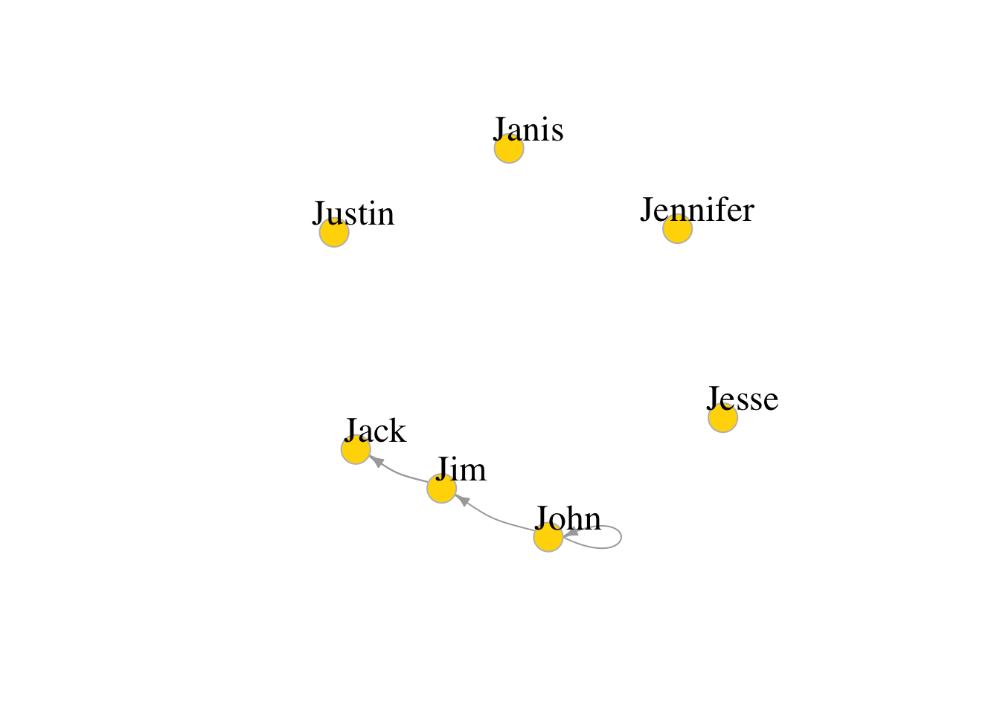{width=672}
:::
:::

::: {.cell}

```{.r .cell-code}
# En general, se pueden llamar colores por el nombre, el código hexadecimal y por los valores rgb
# e.g. "blue" "dark red" "#557799" or rgb(.25, .5, .3))
# Podemos ver los nombres de colores default con colors():
colors() 
```

::: {.cell-output .cell-output-stdout}
```
  [1] "white"                "aliceblue"            "antiquewhite"        
  [4] "antiquewhite1"        "antiquewhite2"        "antiquewhite3"       
  [7] "antiquewhite4"        "aquamarine"           "aquamarine1"         
 [10] "aquamarine2"          "aquamarine3"          "aquamarine4"         
 [13] "azure"                "azure1"               "azure2"              
 [16] "azure3"               "azure4"               "beige"               
 [19] "bisque"               "bisque1"              "bisque2"             
 [22] "bisque3"              "bisque4"              "black"               
 [25] "blanchedalmond"       "blue"                 "blue1"               
 [28] "blue2"                "blue3"                "blue4"               
 [31] "blueviolet"           "brown"                "brown1"              
 [34] "brown2"               "brown3"               "brown4"              
 [37] "burlywood"            "burlywood1"           "burlywood2"          
 [40] "burlywood3"           "burlywood4"           "cadetblue"           
 [43] "cadetblue1"           "cadetblue2"           "cadetblue3"          
 [46] "cadetblue4"           "chartreuse"           "chartreuse1"         
 [49] "chartreuse2"          "chartreuse3"          "chartreuse4"         
 [52] "chocolate"            "chocolate1"           "chocolate2"          
 [55] "chocolate3"           "chocolate4"           "coral"               
 [58] "coral1"               "coral2"               "coral3"              
 [61] "coral4"               "cornflowerblue"       "cornsilk"            
 [64] "cornsilk1"            "cornsilk2"            "cornsilk3"           
 [67] "cornsilk4"            "cyan"                 "cyan1"               
 [70] "cyan2"                "cyan3"                "cyan4"               
 [73] "darkblue"             "darkcyan"             "darkgoldenrod"       
 [76] "darkgoldenrod1"       "darkgoldenrod2"       "darkgoldenrod3"      
 [79] "darkgoldenrod4"       "darkgray"             "darkgreen"           
 [82] "darkgrey"             "darkkhaki"            "darkmagenta"         
 [85] "darkolivegreen"       "darkolivegreen1"      "darkolivegreen2"     
 [88] "darkolivegreen3"      "darkolivegreen4"      "darkorange"          
 [91] "darkorange1"          "darkorange2"          "darkorange3"         
 [94] "darkorange4"          "darkorchid"           "darkorchid1"         
 [97] "darkorchid2"          "darkorchid3"          "darkorchid4"         
[100] "darkred"              "darksalmon"           "darkseagreen"        
[103] "darkseagreen1"        "darkseagreen2"        "darkseagreen3"       
[106] "darkseagreen4"        "darkslateblue"        "darkslategray"       
[109] "darkslategray1"       "darkslategray2"       "darkslategray3"      
[112] "darkslategray4"       "darkslategrey"        "darkturquoise"       
[115] "darkviolet"           "deeppink"             "deeppink1"           
[118] "deeppink2"            "deeppink3"            "deeppink4"           
[121] "deepskyblue"          "deepskyblue1"         "deepskyblue2"        
[124] "deepskyblue3"         "deepskyblue4"         "dimgray"             
[127] "dimgrey"              "dodgerblue"           "dodgerblue1"         
[130] "dodgerblue2"          "dodgerblue3"          "dodgerblue4"         
[133] "firebrick"            "firebrick1"           "firebrick2"          
[136] "firebrick3"           "firebrick4"           "floralwhite"         
[139] "forestgreen"          "gainsboro"            "ghostwhite"          
[142] "gold"                 "gold1"                "gold2"               
[145] "gold3"                "gold4"                "goldenrod"           
[148] "goldenrod1"           "goldenrod2"           "goldenrod3"          
[151] "goldenrod4"           "gray"                 "gray0"               
[154] "gray1"                "gray2"                "gray3"               
[157] "gray4"                "gray5"                "gray6"               
[160] "gray7"                "gray8"                "gray9"               
[163] "gray10"               "gray11"               "gray12"              
[166] "gray13"               "gray14"               "gray15"              
[169] "gray16"               "gray17"               "gray18"              
[172] "gray19"               "gray20"               "gray21"              
[175] "gray22"               "gray23"               "gray24"              
[178] "gray25"               "gray26"               "gray27"              
[181] "gray28"               "gray29"               "gray30"              
[184] "gray31"               "gray32"               "gray33"              
[187] "gray34"               "gray35"               "gray36"              
[190] "gray37"               "gray38"               "gray39"              
[193] "gray40"               "gray41"               "gray42"              
[196] "gray43"               "gray44"               "gray45"              
[199] "gray46"               "gray47"               "gray48"              
[202] "gray49"               "gray50"               "gray51"              
[205] "gray52"               "gray53"               "gray54"              
[208] "gray55"               "gray56"               "gray57"              
[211] "gray58"               "gray59"               "gray60"              
[214] "gray61"               "gray62"               "gray63"              
[217] "gray64"               "gray65"               "gray66"              
[220] "gray67"               "gray68"               "gray69"              
[223] "gray70"               "gray71"               "gray72"              
[226] "gray73"               "gray74"               "gray75"              
[229] "gray76"               "gray77"               "gray78"              
[232] "gray79"               "gray80"               "gray81"              
[235] "gray82"               "gray83"               "gray84"              
[238] "gray85"               "gray86"               "gray87"              
[241] "gray88"               "gray89"               "gray90"              
[244] "gray91"               "gray92"               "gray93"              
[247] "gray94"               "gray95"               "gray96"              
[250] "gray97"               "gray98"               "gray99"              
[253] "gray100"              "green"                "green1"              
[256] "green2"               "green3"               "green4"              
[259] "greenyellow"          "grey"                 "grey0"               
[262] "grey1"                "grey2"                "grey3"               
[265] "grey4"                "grey5"                "grey6"               
[268] "grey7"                "grey8"                "grey9"               
[271] "grey10"               "grey11"               "grey12"              
[274] "grey13"               "grey14"               "grey15"              
[277] "grey16"               "grey17"               "grey18"              
[280] "grey19"               "grey20"               "grey21"              
[283] "grey22"               "grey23"               "grey24"              
[286] "grey25"               "grey26"               "grey27"              
[289] "grey28"               "grey29"               "grey30"              
[292] "grey31"               "grey32"               "grey33"              
[295] "grey34"               "grey35"               "grey36"              
[298] "grey37"               "grey38"               "grey39"              
[301] "grey40"               "grey41"               "grey42"              
[304] "grey43"               "grey44"               "grey45"              
[307] "grey46"               "grey47"               "grey48"              
[310] "grey49"               "grey50"               "grey51"              
[313] "grey52"               "grey53"               "grey54"              
[316] "grey55"               "grey56"               "grey57"              
[319] "grey58"               "grey59"               "grey60"              
[322] "grey61"               "grey62"               "grey63"              
[325] "grey64"               "grey65"               "grey66"              
[328] "grey67"               "grey68"               "grey69"              
[331] "grey70"               "grey71"               "grey72"              
[334] "grey73"               "grey74"               "grey75"              
[337] "grey76"               "grey77"               "grey78"              
[340] "grey79"               "grey80"               "grey81"              
[343] "grey82"               "grey83"               "grey84"              
[346] "grey85"               "grey86"               "grey87"              
[349] "grey88"               "grey89"               "grey90"              
[352] "grey91"               "grey92"               "grey93"              
[355] "grey94"               "grey95"               "grey96"              
[358] "grey97"               "grey98"               "grey99"              
[361] "grey100"              "honeydew"             "honeydew1"           
[364] "honeydew2"            "honeydew3"            "honeydew4"           
[367] "hotpink"              "hotpink1"             "hotpink2"            
[370] "hotpink3"             "hotpink4"             "indianred"           
[373] "indianred1"           "indianred2"           "indianred3"          
[376] "indianred4"           "ivory"                "ivory1"              
[379] "ivory2"               "ivory3"               "ivory4"              
[382] "khaki"                "khaki1"               "khaki2"              
[385] "khaki3"               "khaki4"               "lavender"            
[388] "lavenderblush"        "lavenderblush1"       "lavenderblush2"      
[391] "lavenderblush3"       "lavenderblush4"       "lawngreen"           
[394] "lemonchiffon"         "lemonchiffon1"        "lemonchiffon2"       
[397] "lemonchiffon3"        "lemonchiffon4"        "lightblue"           
[400] "lightblue1"           "lightblue2"           "lightblue3"          
[403] "lightblue4"           "lightcoral"           "lightcyan"           
[406] "lightcyan1"           "lightcyan2"           "lightcyan3"          
[409] "lightcyan4"           "lightgoldenrod"       "lightgoldenrod1"     
[412] "lightgoldenrod2"      "lightgoldenrod3"      "lightgoldenrod4"     
[415] "lightgoldenrodyellow" "lightgray"            "lightgreen"          
[418] "lightgrey"            "lightpink"            "lightpink1"          
[421] "lightpink2"           "lightpink3"           "lightpink4"          
[424] "lightsalmon"          "lightsalmon1"         "lightsalmon2"        
[427] "lightsalmon3"         "lightsalmon4"         "lightseagreen"       
[430] "lightskyblue"         "lightskyblue1"        "lightskyblue2"       
[433] "lightskyblue3"        "lightskyblue4"        "lightslateblue"      
[436] "lightslategray"       "lightslategrey"       "lightsteelblue"      
[439] "lightsteelblue1"      "lightsteelblue2"      "lightsteelblue3"     
[442] "lightsteelblue4"      "lightyellow"          "lightyellow1"        
[445] "lightyellow2"         "lightyellow3"         "lightyellow4"        
[448] "limegreen"            "linen"                "magenta"             
[451] "magenta1"             "magenta2"             "magenta3"            
[454] "magenta4"             "maroon"               "maroon1"             
[457] "maroon2"              "maroon3"              "maroon4"             
[460] "mediumaquamarine"     "mediumblue"           "mediumorchid"        
[463] "mediumorchid1"        "mediumorchid2"        "mediumorchid3"       
[466] "mediumorchid4"        "mediumpurple"         "mediumpurple1"       
[469] "mediumpurple2"        "mediumpurple3"        "mediumpurple4"       
[472] "mediumseagreen"       "mediumslateblue"      "mediumspringgreen"   
[475] "mediumturquoise"      "mediumvioletred"      "midnightblue"        
[478] "mintcream"            "mistyrose"            "mistyrose1"          
[481] "mistyrose2"           "mistyrose3"           "mistyrose4"          
[484] "moccasin"             "navajowhite"          "navajowhite1"        
[487] "navajowhite2"         "navajowhite3"         "navajowhite4"        
[490] "navy"                 "navyblue"             "oldlace"             
[493] "olivedrab"            "olivedrab1"           "olivedrab2"          
[496] "olivedrab3"           "olivedrab4"           "orange"              
[499] "orange1"              "orange2"              "orange3"             
[502] "orange4"              "orangered"            "orangered1"          
[505] "orangered2"           "orangered3"           "orangered4"          
[508] "orchid"               "orchid1"              "orchid2"             
[511] "orchid3"              "orchid4"              "palegoldenrod"       
[514] "palegreen"            "palegreen1"           "palegreen2"          
[517] "palegreen3"           "palegreen4"           "paleturquoise"       
[520] "paleturquoise1"       "paleturquoise2"       "paleturquoise3"      
[523] "paleturquoise4"       "palevioletred"        "palevioletred1"      
[526] "palevioletred2"       "palevioletred3"       "palevioletred4"      
[529] "papayawhip"           "peachpuff"            "peachpuff1"          
[532] "peachpuff2"           "peachpuff3"           "peachpuff4"          
[535] "peru"                 "pink"                 "pink1"               
[538] "pink2"                "pink3"                "pink4"               
[541] "plum"                 "plum1"                "plum2"               
[544] "plum3"                "plum4"                "powderblue"          
[547] "purple"               "purple1"              "purple2"             
[550] "purple3"              "purple4"              "red"                 
[553] "red1"                 "red2"                 "red3"                
[556] "red4"                 "rosybrown"            "rosybrown1"          
[559] "rosybrown2"           "rosybrown3"           "rosybrown4"          
[562] "royalblue"            "royalblue1"           "royalblue2"          
[565] "royalblue3"           "royalblue4"           "saddlebrown"         
[568] "salmon"               "salmon1"              "salmon2"             
[571] "salmon3"              "salmon4"              "sandybrown"          
[574] "seagreen"             "seagreen1"            "seagreen2"           
[577] "seagreen3"            "seagreen4"            "seashell"            
[580] "seashell1"            "seashell2"            "seashell3"           
[583] "seashell4"            "sienna"               "sienna1"             
[586] "sienna2"              "sienna3"              "sienna4"             
[589] "skyblue"              "skyblue1"             "skyblue2"            
[592] "skyblue3"             "skyblue4"             "slateblue"           
[595] "slateblue1"           "slateblue2"           "slateblue3"          
[598] "slateblue4"           "slategray"            "slategray1"          
[601] "slategray2"           "slategray3"           "slategray4"          
[604] "slategrey"            "snow"                 "snow1"               
[607] "snow2"                "snow3"                "snow4"               
[610] "springgreen"          "springgreen1"         "springgreen2"        
[613] "springgreen3"         "springgreen4"         "steelblue"           
[616] "steelblue1"           "steelblue2"           "steelblue3"          
[619] "steelblue4"           "tan"                  "tan1"                
[622] "tan2"                 "tan3"                 "tan4"                
[625] "thistle"              "thistle1"             "thistle2"            
[628] "thistle3"             "thistle4"             "tomato"              
[631] "tomato1"              "tomato2"              "tomato3"             
[634] "tomato4"              "turquoise"            "turquoise1"          
[637] "turquoise2"           "turquoise3"           "turquoise4"          
[640] "violet"               "violetred"            "violetred1"          
[643] "violetred2"           "violetred3"           "violetred4"          
[646] "wheat"                "wheat1"               "wheat2"              
[649] "wheat3"               "wheat4"               "whitesmoke"          
[652] "yellow"               "yellow1"              "yellow2"             
[655] "yellow3"              "yellow4"              "yellowgreen"         
```
:::

```{.r .cell-code}
# Ya vimos que podíamos acceder a los vértices y enlaces mediante
E(g4) # Enlaces
```

::: {.cell-output .cell-output-stdout}
```
+ 4/4 edges from 3b51b7d (vertex names):
[1] John->Jim  Jim ->Jack Jim ->Jack John->John
```
:::

```{.r .cell-code}
V(g4) # Vértices
```

::: {.cell-output .cell-output-stdout}
```
+ 7/7 vertices, named, from 3b51b7d:
[1] John     Jim      Jack     Jesse    Janis    Jennifer Justin  
```
:::
:::

::: {.cell}

```{.r .cell-code}
# Se puede examinar la matriz de la red directamente también mediante
g4[] # la matriz de adyacencia completa (de tipo sparse para gastar menos memoria)
```

::: {.cell-output .cell-output-stdout}
```
7 x 7 sparse Matrix of class "dgCMatrix"
         John Jim Jack Jesse Janis Jennifer Justin
John        1   1    .     .     .        .      .
Jim         .   .    2     .     .        .      .
Jack        .   .    .     .     .        .      .
Jesse       .   .    .     .     .        .      .
Janis       .   .    .     .     .        .      .
Jennifer    .   .    .     .     .        .      .
Justin      .   .    .     .     .        .      .
```
:::

```{.r .cell-code}
g4[1,] # la fila de John
```

::: {.cell-output .cell-output-stdout}
```
    John      Jim     Jack    Jesse    Janis Jennifer   Justin 
       1        1        0        0        0        0        0 
```
:::
:::

::: {.cell}

```{.r .cell-code}
# Podemos llamar y añadir/quitar atributos a la red, los vértices y los enlaces haciendo:

V(g4)$name # Se genera automáticamente cuando se crea la red.
```

::: {.cell-output .cell-output-stdout}
```
[1] "John"     "Jim"      "Jack"     "Jesse"    "Janis"    "Jennifer" "Justin"  
```
:::

```{.r .cell-code}
V(g4)$gender <- c("male", "male", "male", "male", "female", "female", "male") 
E(g4)$type <- "email" # Atributo de enlace, asignado "email" para todos los enlaces.
E(g4)$weight <- 10    # Atributo de peso, asignandole peso 10 a todos los enlaces existentes.
```
:::

::: {.cell}

```{.r .cell-code}
# Examinemos los atributos
# de los enlaces
edge_attr(g4)
```

::: {.cell-output .cell-output-stdout}
```
$type
[1] "email" "email" "email" "email"

$weight
[1] 10 10 10 10
```
:::

```{.r .cell-code}
# de los vértices
vertex_attr(g4)
```

::: {.cell-output .cell-output-stdout}
```
$name
[1] "John"     "Jim"      "Jack"     "Jesse"    "Janis"    "Jennifer" "Justin"  

$gender
[1] "male"   "male"   "male"   "male"   "female" "female" "male"  
```
:::

```{.r .cell-code}
# de la red
graph_attr(g4)
```

::: {.cell-output .cell-output-stdout}
```
named list()
```
:::
:::

::: {.cell}

```{.r .cell-code}
# Otra forma de settear atributos
# Análogamente se puede usar set_edge_attr() y set_vertex_attr(), así como get.edge.attribute(), etc.
g4 <- set_graph_attr(g4, "name", "Email Network") 
g4 <- set_graph_attr(g4, "something", "A thing")

graph_attr_names(g4) 
```

::: {.cell-output .cell-output-stdout}
```
[1] "name"      "something"
```
:::

```{.r .cell-code}
graph_attr(g4, "name")
```

::: {.cell-output .cell-output-stdout}
```
[1] "Email Network"
```
:::

```{.r .cell-code}
graph_attr(g4)
```

::: {.cell-output .cell-output-stdout}
```
$name
[1] "Email Network"

$something
[1] "A thing"
```
:::

```{.r .cell-code}
g4 <- delete_graph_attr(g4, "something")
graph_attr(g4)
```

::: {.cell-output .cell-output-stdout}
```
$name
[1] "Email Network"
```
:::
:::

::: {.cell}

```{.r .cell-code}
plot(g4, edge.arrow.size=.5, vertex.label.color="black", vertex.label.dist=1.5,
     vertex.color=c( "pink", "skyblue")[1+(V(g4)$gender=="male")] ) 
```

::: {.cell-output-display}
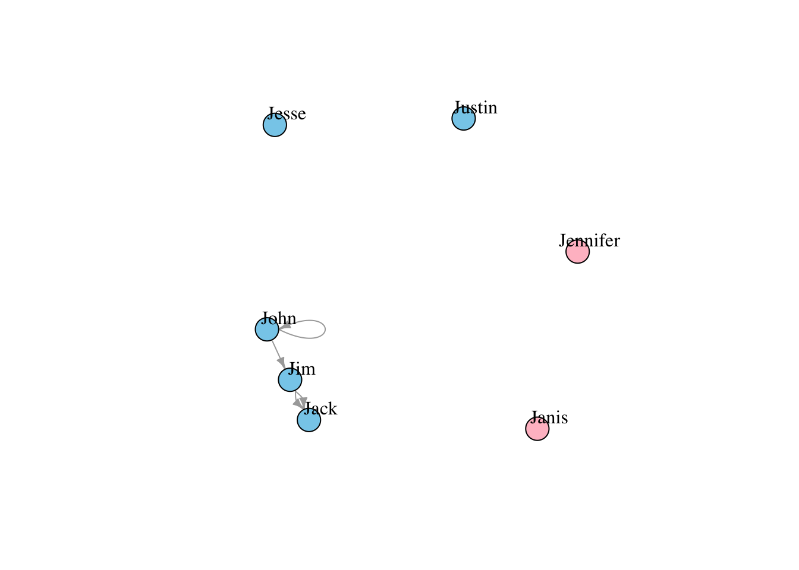{width=672}
:::
:::

::: {.cell}

```{.r .cell-code}
# g4 tiene dos aristas que van de Jim a Jack y un bucle de John a él mismo.
# Podemos simplificar nuestro gráfico para eliminar bucles y múltiples bordes entre los mismos nodos.
# Usamos 'edge.attr.comb' para indicar cómo se combinarán los atributos de enlace - posibles
# opciones incluyen "suma", "media", "prod" (producto), min, max, primero/último (selecciona
# el atributo del primer/último enlace). La opción "ignorar" dice que el atributo debe ser
# ignorado y descartado.


g4s <- simplify( g4, remove.multiple = T, remove.loops = F, 
                 edge.attr.comb=list(weight="sum", type="ignore") )
plot(g4s, vertex.label.dist=1.5)
```

::: {.cell-output-display}
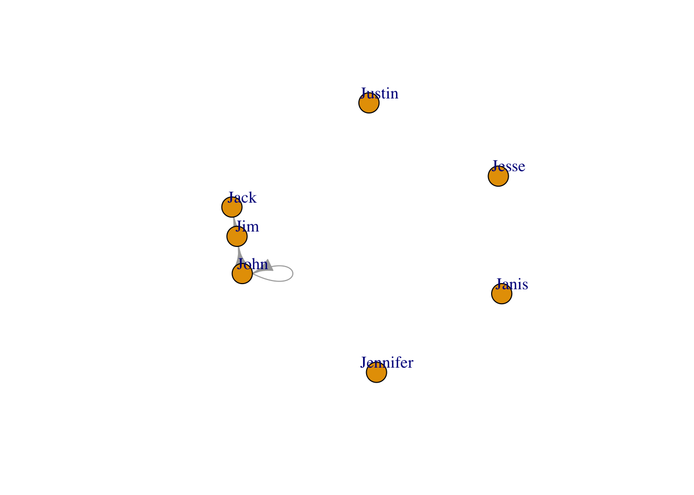{width=672}
:::

```{.r .cell-code}
g4s
```

::: {.cell-output .cell-output-stdout}
```
IGRAPH e7b0b61 DNW- 7 3 -- Email Network
+ attr: name (g/c), name (v/c), gender (v/c), weight (e/n)
+ edges from e7b0b61 (vertex names):
[1] John->John John->Jim  Jim ->Jack
```
:::
:::


# Centralidad

Las medidas de centralidad se utilizan para identificar los nodos más importantes de una red. Las medidas de centralidad más utilizadas son la centralidad de grado, la centralidad de intermediación y la centralidad de cercanía. La centralidad de grado mide la cantidad de conexiones que tiene un nodo, la centralidad de intermediación mide la cantidad de rutas más cortas en las que se encuentra un nodo y la centralidad de cercanía mide la distancia promedio de un nodo a todos los demás nodos en la red.


::: {.cell}

```{.r .cell-code}
# Calcular índices de red
# Calcular grado de centralidad (degree centrality) 
degree_centrality <- degree(g) 

# Calcular centralidad de cercanía 
closeness_centrality <- closeness(g) 

# Calcular la centralidad de intermediación
betweenness_centrality <- betweenness(g)

# Analiza el grafo de red
# Calcular la transitividad del grafo de red
transitivity <- transitivity(g, type = 'global') 
# Calcular la longitud de ruta promedio entre nodos
avg_path_length <- average.path.length(g) 
# Calcular la densidad de la red
density <- graph.density(g) 
```
:::


# Leyendo datos de redes
## 1. Datos como edgelist: DATASET 1

::: {.cell}

```{.r .cell-code}
nodes <- read.csv("data/Dataset1-Media-Example-NODES.csv", header=T, as.is=T)
links <- read.csv("data/Dataset1-Media-Example-EDGES.csv", header=T, as.is=T)

# Examinamos la data
head(nodes)
```

::: {.cell-output .cell-output-stdout}
```
   id               media media.type type.label audience.size
1 s01            NY Times          1  Newspaper            20
2 s02     Washington Post          1  Newspaper            25
3 s03 Wall Street Journal          1  Newspaper            30
4 s04           USA Today          1  Newspaper            32
5 s05            LA Times          1  Newspaper            20
6 s06       New York Post          1  Newspaper            50
```
:::

```{.r .cell-code}
head(links)
```

::: {.cell-output .cell-output-stdout}
```
  from  to weight      type
1  s01 s02     10 hyperlink
2  s01 s02     12 hyperlink
3  s01 s03     22 hyperlink
4  s01 s04     21 hyperlink
5  s04 s11     22   mention
6  s05 s15     21   mention
```
:::

```{.r .cell-code}
nrow(nodes); length(unique(nodes$id))
```

::: {.cell-output .cell-output-stdout}
```
[1] 17
```
:::

::: {.cell-output .cell-output-stdout}
```
[1] 17
```
:::

```{.r .cell-code}
nrow(links); nrow(unique(links[,c("from", "to")]))
```

::: {.cell-output .cell-output-stdout}
```
[1] 52
```
:::

::: {.cell-output .cell-output-stdout}
```
[1] 49
```
:::
:::

::: {.cell}

```{.r .cell-code}
# Colapsamos multiples links del mismo tipo entre los mismos dos nodos sumando sus pesos, 
# usaremos aggregate() (del base R), usando by "from", "to", y "type":
# No usamos "simplify()" acá, para no colapsar los distintos tipos de enlaces.
links <- aggregate(links[,3], links[,-3], sum)
links <- links[order(links$from, links$to),]
colnames(links)[4] <- "weight"
rownames(links) <- NULL
```
:::


## Creando objetos de igraph

::: {.cell}

```{.r .cell-code}
library(igraph)

# --- DATASET 1 

# Convirtiendo los datos a un objeto de igraph:
# La función graph.data.frame, que toma dos data frames: 'd' y 'vertices'.
# 'd' describe los enlaces de la red - Debería empezar con dos columnas que contengan 
# los ID's del emisor (source) y el receptor (target) para cada enlace.
# 'vertices' debería comenzar con una columna de ID de los nodos
# Cada columna adicional en cada data frame es interpretado como atributos de los enlaces y de los nodos respectivamente.

net <- graph_from_data_frame(d=links, vertices=nodes, directed=T) 

# Veamos el objeto que resulta
class(net)
```

::: {.cell-output .cell-output-stdout}
```
[1] "igraph"
```
:::

```{.r .cell-code}
net
```

::: {.cell-output .cell-output-stdout}
```
IGRAPH b6241a8 DNW- 17 49 -- 
+ attr: name (v/c), media (v/c), media.type (v/n), type.label (v/c),
| audience.size (v/n), type (e/c), weight (e/n)
+ edges from b6241a8 (vertex names):
 [1] s01->s02 s01->s03 s01->s04 s01->s15 s02->s01 s02->s03 s02->s09 s02->s10
 [9] s03->s01 s03->s04 s03->s05 s03->s08 s03->s10 s03->s11 s03->s12 s04->s03
[17] s04->s06 s04->s11 s04->s12 s04->s17 s05->s01 s05->s02 s05->s09 s05->s15
[25] s06->s06 s06->s16 s06->s17 s07->s03 s07->s08 s07->s10 s07->s14 s08->s03
[33] s08->s07 s08->s09 s09->s10 s10->s03 s12->s06 s12->s13 s12->s14 s13->s12
[41] s13->s17 s14->s11 s14->s13 s15->s01 s15->s04 s15->s06 s16->s06 s16->s17
[49] s17->s04
```
:::
:::

::: {.cell}

```{.r .cell-code}
# Miramos los nodos, enlaces y sus atributos:
E(net)
```

::: {.cell-output .cell-output-stdout}
```
+ 49/49 edges from b6241a8 (vertex names):
 [1] s01->s02 s01->s03 s01->s04 s01->s15 s02->s01 s02->s03 s02->s09 s02->s10
 [9] s03->s01 s03->s04 s03->s05 s03->s08 s03->s10 s03->s11 s03->s12 s04->s03
[17] s04->s06 s04->s11 s04->s12 s04->s17 s05->s01 s05->s02 s05->s09 s05->s15
[25] s06->s06 s06->s16 s06->s17 s07->s03 s07->s08 s07->s10 s07->s14 s08->s03
[33] s08->s07 s08->s09 s09->s10 s10->s03 s12->s06 s12->s13 s12->s14 s13->s12
[41] s13->s17 s14->s11 s14->s13 s15->s01 s15->s04 s15->s06 s16->s06 s16->s17
[49] s17->s04
```
:::

```{.r .cell-code}
V(net)
```

::: {.cell-output .cell-output-stdout}
```
+ 17/17 vertices, named, from b6241a8:
 [1] s01 s02 s03 s04 s05 s06 s07 s08 s09 s10 s11 s12 s13 s14 s15 s16 s17
```
:::

```{.r .cell-code}
E(net)$type
```

::: {.cell-output .cell-output-stdout}
```
 [1] "hyperlink" "hyperlink" "hyperlink" "mention"   "hyperlink" "hyperlink"
 [7] "hyperlink" "hyperlink" "hyperlink" "hyperlink" "hyperlink" "hyperlink"
[13] "mention"   "hyperlink" "hyperlink" "hyperlink" "mention"   "mention"  
[19] "hyperlink" "mention"   "mention"   "hyperlink" "hyperlink" "mention"  
[25] "hyperlink" "hyperlink" "mention"   "mention"   "mention"   "hyperlink"
[31] "mention"   "hyperlink" "mention"   "mention"   "mention"   "hyperlink"
[37] "mention"   "hyperlink" "mention"   "hyperlink" "mention"   "mention"  
[43] "mention"   "hyperlink" "hyperlink" "hyperlink" "hyperlink" "mention"  
[49] "hyperlink"
```
:::

```{.r .cell-code}
V(net)$media
```

::: {.cell-output .cell-output-stdout}
```
 [1] "NY Times"            "Washington Post"     "Wall Street Journal"
 [4] "USA Today"           "LA Times"            "New York Post"      
 [7] "CNN"                 "MSNBC"               "FOX News"           
[10] "ABC"                 "BBC"                 "Yahoo News"         
[13] "Google News"         "Reuters.com"         "NYTimes.com"        
[16] "WashingtonPost.com"  "AOL.com"            
```
:::
:::

::: {.cell}

```{.r .cell-code}
plot(net, edge.arrow.size=.4,vertex.label=NA)
```

::: {.cell-output-display}
{width=672}
:::
:::

::: {.cell}

```{.r .cell-code}
# Sacamos los loops del grafo:
net <- simplify(net, remove.multiple = F, remove.loops = T)
```
:::

::: {.cell}

```{.r .cell-code}
# Si lo necesitamos, podemos extraer la lista de enlaces (edgelist) o la matriz desde la red de igraph.
as_edgelist(net, names=T)
```

::: {.cell-output .cell-output-stdout}
```
      [,1]  [,2] 
 [1,] "s01" "s02"
 [2,] "s01" "s03"
 [3,] "s01" "s04"
 [4,] "s01" "s15"
 [5,] "s02" "s01"
 [6,] "s02" "s03"
 [7,] "s02" "s09"
 [8,] "s02" "s10"
 [9,] "s03" "s01"
[10,] "s03" "s04"
[11,] "s03" "s05"
[12,] "s03" "s08"
[13,] "s03" "s10"
[14,] "s03" "s11"
[15,] "s03" "s12"
[16,] "s04" "s03"
[17,] "s04" "s06"
[18,] "s04" "s11"
[19,] "s04" "s12"
[20,] "s04" "s17"
[21,] "s05" "s01"
[22,] "s05" "s02"
[23,] "s05" "s09"
[24,] "s05" "s15"
[25,] "s06" "s16"
[26,] "s06" "s17"
[27,] "s07" "s03"
[28,] "s07" "s08"
[29,] "s07" "s10"
[30,] "s07" "s14"
[31,] "s08" "s03"
[32,] "s08" "s07"
[33,] "s08" "s09"
[34,] "s09" "s10"
[35,] "s10" "s03"
[36,] "s12" "s06"
[37,] "s12" "s13"
[38,] "s12" "s14"
[39,] "s13" "s12"
[40,] "s13" "s17"
[41,] "s14" "s11"
[42,] "s14" "s13"
[43,] "s15" "s01"
[44,] "s15" "s04"
[45,] "s15" "s06"
[46,] "s16" "s06"
[47,] "s16" "s17"
[48,] "s17" "s04"
```
:::

```{.r .cell-code}
as_adjacency_matrix(net, attr="weight")
```

::: {.cell-output .cell-output-stdout}
```
17 x 17 sparse Matrix of class "dgCMatrix"
                                                     
s01  . 22 22 21 .  .  .  .  .  .  .  .  .  . 20  .  .
s02 23  . 21  . .  .  .  .  1  5  .  .  .  .  .  .  .
s03 21  .  . 22 1  .  .  4  .  2  1  1  .  .  .  .  .
s04  .  . 23  . .  1  .  .  .  . 22  3  .  .  .  .  2
s05  1 21  .  . .  .  .  .  2  .  .  .  .  . 21  .  .
s06  .  .  .  . .  .  .  .  .  .  .  .  .  .  . 21 21
s07  .  .  1  . .  .  . 22  . 21  .  .  .  4  .  .  .
s08  .  .  2  . .  . 21  . 23  .  .  .  .  .  .  .  .
s09  .  .  .  . .  .  .  .  . 21  .  .  .  .  .  .  .
s10  .  .  2  . .  .  .  .  .  .  .  .  .  .  .  .  .
s11  .  .  .  . .  .  .  .  .  .  .  .  .  .  .  .  .
s12  .  .  .  . .  2  .  .  .  .  .  . 22 22  .  .  .
s13  .  .  .  . .  .  .  .  .  .  . 21  .  .  .  .  1
s14  .  .  .  . .  .  .  .  .  .  1  . 21  .  .  .  .
s15 22  .  .  1 .  4  .  .  .  .  .  .  .  .  .  .  .
s16  .  .  .  . . 23  .  .  .  .  .  .  .  .  .  . 21
s17  .  .  .  4 .  .  .  .  .  .  .  .  .  .  .  .  .
```
:::
:::

::: {.cell}

```{.r .cell-code}
# O data frames que describan los nodos y los enlaces:
as_data_frame(net, what="edges")
```

::: {.cell-output .cell-output-stdout}
```
   from  to      type weight
1   s01 s02 hyperlink     22
2   s01 s03 hyperlink     22
3   s01 s04 hyperlink     21
4   s01 s15   mention     20
5   s02 s01 hyperlink     23
6   s02 s03 hyperlink     21
7   s02 s09 hyperlink      1
8   s02 s10 hyperlink      5
9   s03 s01 hyperlink     21
10  s03 s04 hyperlink     22
11  s03 s05 hyperlink      1
12  s03 s08 hyperlink      4
13  s03 s10   mention      2
14  s03 s11 hyperlink      1
15  s03 s12 hyperlink      1
16  s04 s03 hyperlink     23
17  s04 s06   mention      1
18  s04 s11   mention     22
19  s04 s12 hyperlink      3
20  s04 s17   mention      2
21  s05 s01   mention      1
22  s05 s02 hyperlink     21
23  s05 s09 hyperlink      2
24  s05 s15   mention     21
25  s06 s16 hyperlink     21
26  s06 s17   mention     21
27  s07 s03   mention      1
28  s07 s08   mention     22
29  s07 s10 hyperlink     21
30  s07 s14   mention      4
31  s08 s03 hyperlink      2
32  s08 s07   mention     21
33  s08 s09   mention     23
34  s09 s10   mention     21
35  s10 s03 hyperlink      2
36  s12 s06   mention      2
37  s12 s13 hyperlink     22
38  s12 s14   mention     22
39  s13 s12 hyperlink     21
40  s13 s17   mention      1
41  s14 s11   mention      1
42  s14 s13   mention     21
43  s15 s01 hyperlink     22
44  s15 s04 hyperlink      1
45  s15 s06 hyperlink      4
46  s16 s06 hyperlink     23
47  s16 s17   mention     21
48  s17 s04 hyperlink      4
```
:::

```{.r .cell-code}
as_data_frame(net, what="vertices")
```

::: {.cell-output .cell-output-stdout}
```
    name               media media.type type.label audience.size
s01  s01            NY Times          1  Newspaper            20
s02  s02     Washington Post          1  Newspaper            25
s03  s03 Wall Street Journal          1  Newspaper            30
s04  s04           USA Today          1  Newspaper            32
s05  s05            LA Times          1  Newspaper            20
s06  s06       New York Post          1  Newspaper            50
s07  s07                 CNN          2         TV            56
s08  s08               MSNBC          2         TV            34
s09  s09            FOX News          2         TV            60
s10  s10                 ABC          2         TV            23
s11  s11                 BBC          2         TV            34
s12  s12          Yahoo News          3     Online            33
s13  s13         Google News          3     Online            23
s14  s14         Reuters.com          3     Online            12
s15  s15         NYTimes.com          3     Online            24
s16  s16  WashingtonPost.com          3     Online            28
s17  s17             AOL.com          3     Online            33
```
:::
:::


# Graficando redes con igraph

::: {.cell}

```{.r .cell-code}
# Ploteando con igraph:
# opciones de nodos: argumento partiendo con `vertex.`
# opciones de enlaces: argumento partiendo con `edge.`
# Acá podemos ver una lista de opciones
?igraph.plotting
```
:::

::: {.cell}

```{.r .cell-code}
# Podemos setear las node & edge options de dos formas: una es especificarlas en el argumento de plot(), por ejemplo:
# Plot con edges curvos (edge.curved=.1) y el tamaño de la flecha reducido:
plot(net, edge.arrow.size=.4, edge.curved=.1)
```

::: {.cell-output-display}
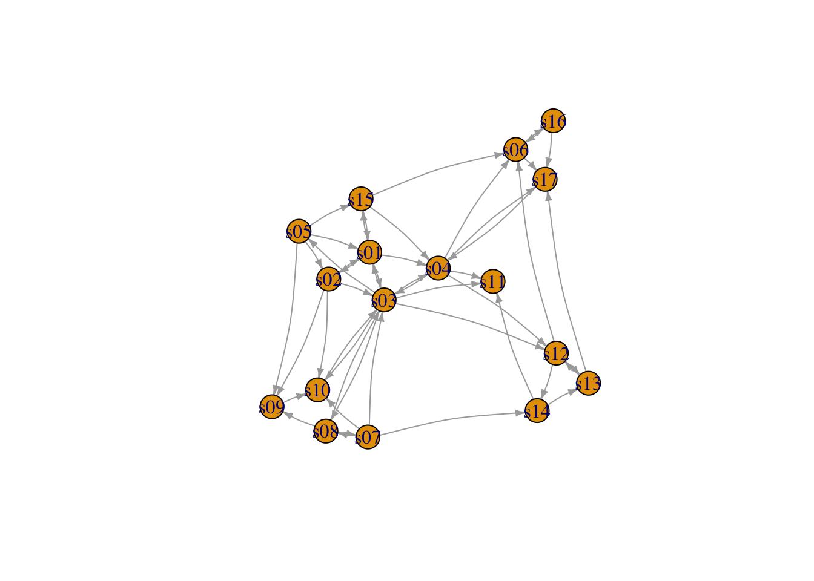{width=672}
:::
:::

::: {.cell}

```{.r .cell-code}
# Seteamos el color del nodo a naranjo y el color del borde a hex #555555
# Reemplazamos las etiquetas de los vértices con los nombres de los nodos que están almacenados en el atributo "media".
plot(net, edge.arrow.size=.2, edge.curved=0,
     vertex.color="orange", vertex.frame.color="#555555",
     vertex.label=V(net)$media, vertex.label.color="black",
     vertex.label.cex=.7)
```

::: {.cell-output-display}
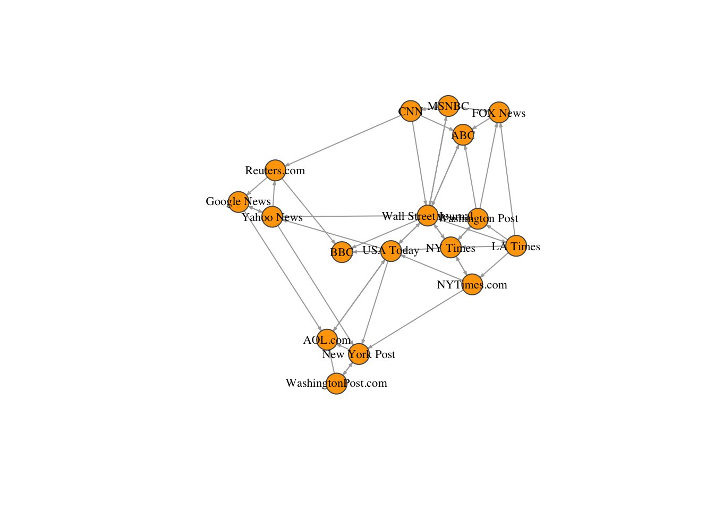{width=672}
:::
:::

::: {.cell}

```{.r .cell-code}
# La segunda manera de setear atributos que modifiquen el plot es añadírselo al objeto de igraph.

# Generar colores basados en "media.type":
colrs <- c("gray50", "tomato", "gold")
V(net)$color <- colrs[V(net)$media.type]

# Seteamos el tamaño del nodo basado en el tamaño de la audiencia:
V(net)$size <- V(net)$audience.size*0.7

# Los labels en este momento son los IDs de los nodos.
# Si los seteamos a NA, el gráfico no va a mostrar lables:
V(net)$label.color <- "black"
V(net)$label <- NA

# Seteamos el ancho de los enlaces basados en el peso:
E(net)$width <- E(net)$weight/6

#Cambiamos el tamaño de la flecha y el color de la arista:
E(net)$arrow.size <- .2
E(net)$edge.color <- "gray80"

# Podemos setear también el layout de la red:
graph_attr(net, "layout") <- layout_with_lgl
plot(net)
```

::: {.cell-output-display}
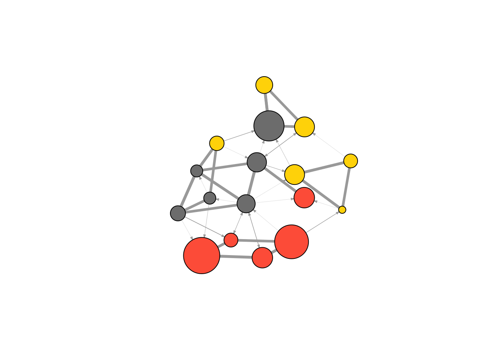{width=672}
:::
:::

::: {.cell}

```{.r .cell-code}
# Podemos también pasar por sobre los atributos al usar el argumento explícito en el plot:
plot(net, edge.color="orange", vertex.color="gray50")
```

::: {.cell-output-display}
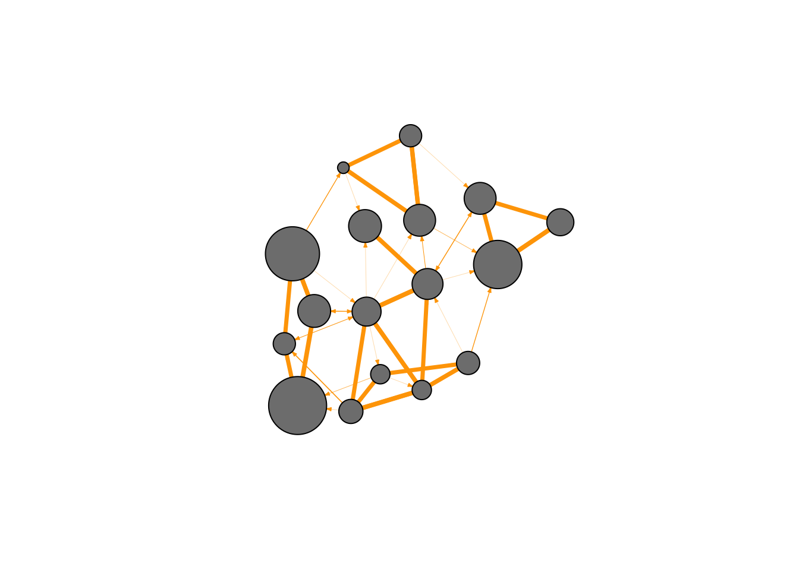{width=672}
:::
:::

::: {.cell}

```{.r .cell-code}
# Podemos también añadir una leyenda explicando el significado de los colores que usamos:
plot(net) 
legend(x=-1.1, y=-1.1, c("Newspaper","Television", "Online News"), pch=21,
       col="#777777", pt.bg=colrs, pt.cex=2.5, bty="n", ncol=1)
```

::: {.cell-output-display}
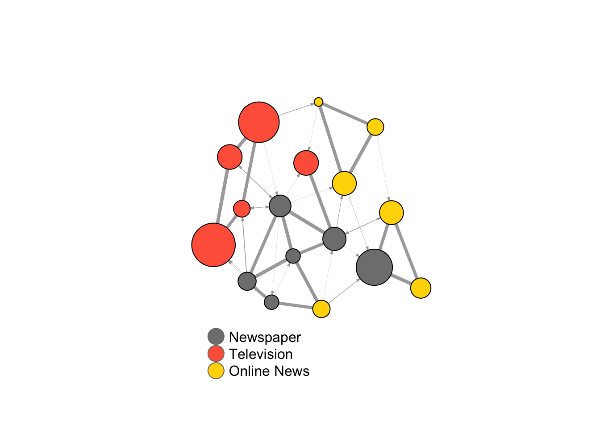{width=672}
:::
:::

::: {.cell}

```{.r .cell-code}
# A veces, especialmente con redes semánticas, podemos estar interesados en plotear solo los labels de los nodos:

plot(net, vertex.shape="none", vertex.label=V(net)$media, 
     vertex.label.font=2, vertex.label.color="gray40",
     vertex.label.cex=.7, edge.color="gray85")
```

::: {.cell-output-display}
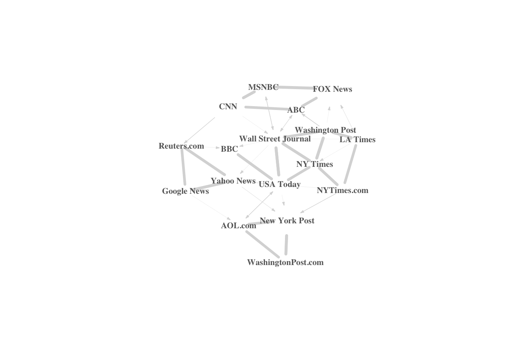{width=672}
:::
:::

::: {.cell}

```{.r .cell-code}
# Podemos añadir color a los enlaces del grafo basados en el color del nodo emisor o source
# Vamos a obtener el nodo de comienzo para cada enlace con "ends()".
edge.start <- ends(net, es=E(net), names=F)[,1]
edge.col <- V(net)$color[edge.start]

plot(net, edge.color=edge.col, edge.curved=.1)
```

::: {.cell-output-display}
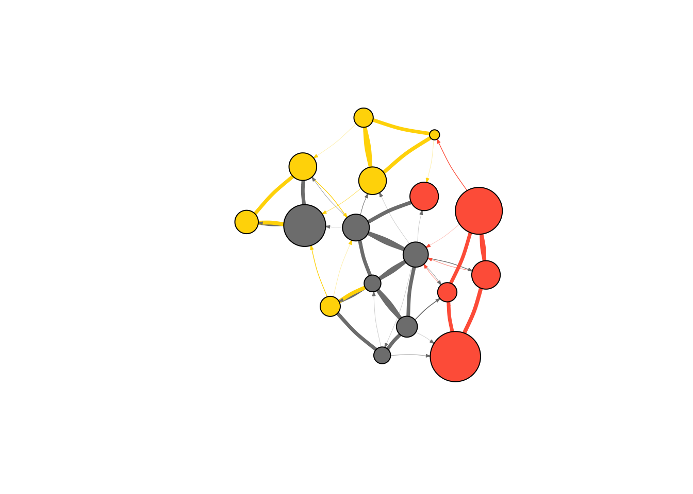{width=672}
:::
:::


# Layouts y algoritmos de visualización de redes. 
Existen muchas formas de visualizar una red. Los grafos se pueden visualizar como nodos y aristas, o como matrices, que muestran las conexiones entre los nodos. Los grafos también se pueden visualizar mediante diagramas de red, que muestran la estructura de la red como una serie de nodos interconectados. Existen muchos layouts de redes, que son algoritmos que al computarse, retornan coordenadas para cada nodo (y cada enlace) en una red.


::: {.cell}

```{.r .cell-code}
# Generemos un grafo relativamente largo de 80 nodos.

net.bg <- sample_pa(80, 1.2) 
V(net.bg)$size <- 8
V(net.bg)$frame.color <- "white"
V(net.bg)$color <- "orange"
V(net.bg)$label <- "" 
E(net.bg)$arrow.mode <- 0
plot(net.bg)
```

::: {.cell-output-display}
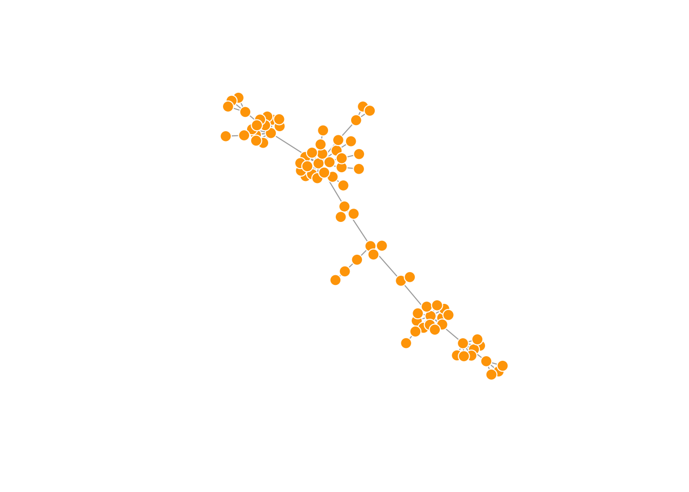{width=672}
:::
:::

::: {.cell}

```{.r .cell-code}
# Se puede settear el layout en la función plot:
plot(net.bg, layout=layout_randomly)
```

::: {.cell-output-display}
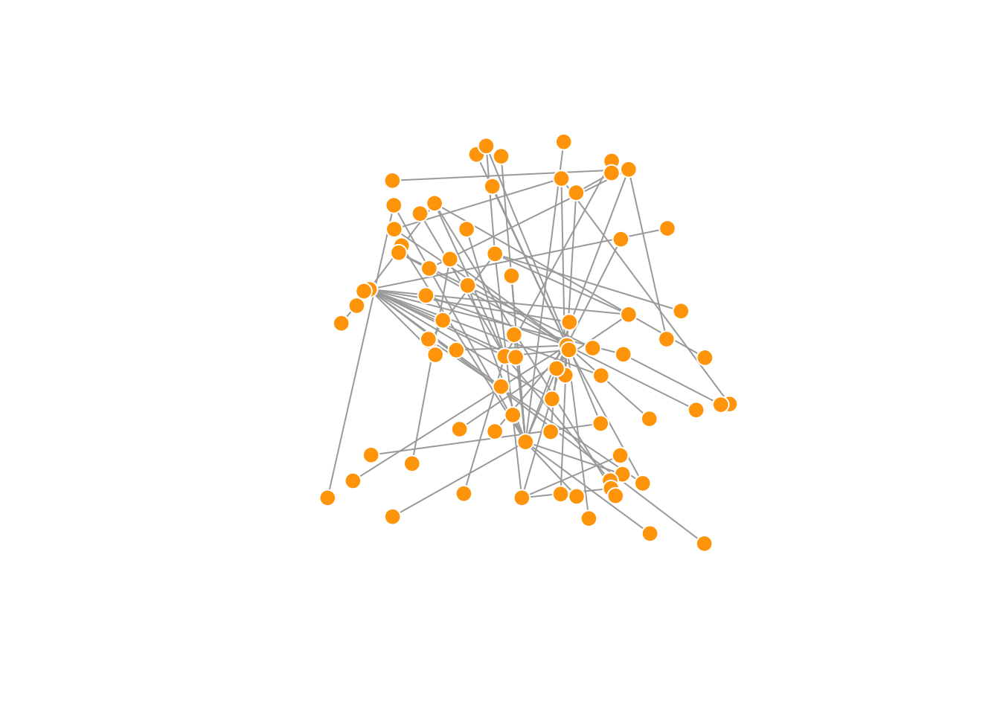{width=672}
:::
:::

::: {.cell}

```{.r .cell-code}
# O también calcular las coordenadas de los vértices por adelantado:
l <- layout_in_circle(net.bg) # un nuevo layout
plot(net.bg, layout=l)
```

::: {.cell-output-display}
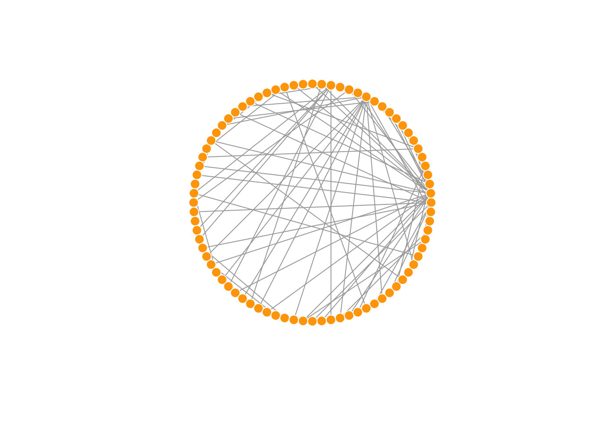{width=672}
:::
:::

::: {.cell}

```{.r .cell-code}
# l es simplemente una matriz de coordenadas x,y (N x 2) para los N nodos en el grafo
# Puedes generar una propia:
l
```

::: {.cell-output .cell-output-stdout}
```
               [,1]          [,2]
 [1,]  1.000000e+00  0.000000e+00
 [2,]  9.969173e-01  7.845910e-02
 [3,]  9.876883e-01  1.564345e-01
 [4,]  9.723699e-01  2.334454e-01
 [5,]  9.510565e-01  3.090170e-01
 [6,]  9.238795e-01  3.826834e-01
 [7,]  8.910065e-01  4.539905e-01
 [8,]  8.526402e-01  5.224986e-01
 [9,]  8.090170e-01  5.877853e-01
[10,]  7.604060e-01  6.494480e-01
[11,]  7.071068e-01  7.071068e-01
[12,]  6.494480e-01  7.604060e-01
[13,]  5.877853e-01  8.090170e-01
[14,]  5.224986e-01  8.526402e-01
[15,]  4.539905e-01  8.910065e-01
[16,]  3.826834e-01  9.238795e-01
[17,]  3.090170e-01  9.510565e-01
[18,]  2.334454e-01  9.723699e-01
[19,]  1.564345e-01  9.876883e-01
[20,]  7.845910e-02  9.969173e-01
[21,]  6.123234e-17  1.000000e+00
[22,] -7.845910e-02  9.969173e-01
[23,] -1.564345e-01  9.876883e-01
[24,] -2.334454e-01  9.723699e-01
[25,] -3.090170e-01  9.510565e-01
[26,] -3.826834e-01  9.238795e-01
[27,] -4.539905e-01  8.910065e-01
[28,] -5.224986e-01  8.526402e-01
[29,] -5.877853e-01  8.090170e-01
[30,] -6.494480e-01  7.604060e-01
[31,] -7.071068e-01  7.071068e-01
[32,] -7.604060e-01  6.494480e-01
[33,] -8.090170e-01  5.877853e-01
[34,] -8.526402e-01  5.224986e-01
[35,] -8.910065e-01  4.539905e-01
[36,] -9.238795e-01  3.826834e-01
[37,] -9.510565e-01  3.090170e-01
[38,] -9.723699e-01  2.334454e-01
[39,] -9.876883e-01  1.564345e-01
[40,] -9.969173e-01  7.845910e-02
[41,] -1.000000e+00  1.224647e-16
[42,] -9.969173e-01 -7.845910e-02
[43,] -9.876883e-01 -1.564345e-01
[44,] -9.723699e-01 -2.334454e-01
[45,] -9.510565e-01 -3.090170e-01
[46,] -9.238795e-01 -3.826834e-01
[47,] -8.910065e-01 -4.539905e-01
[48,] -8.526402e-01 -5.224986e-01
[49,] -8.090170e-01 -5.877853e-01
[50,] -7.604060e-01 -6.494480e-01
[51,] -7.071068e-01 -7.071068e-01
[52,] -6.494480e-01 -7.604060e-01
[53,] -5.877853e-01 -8.090170e-01
[54,] -5.224986e-01 -8.526402e-01
[55,] -4.539905e-01 -8.910065e-01
[56,] -3.826834e-01 -9.238795e-01
[57,] -3.090170e-01 -9.510565e-01
[58,] -2.334454e-01 -9.723699e-01
[59,] -1.564345e-01 -9.876883e-01
[60,] -7.845910e-02 -9.969173e-01
[61,] -1.836970e-16 -1.000000e+00
[62,]  7.845910e-02 -9.969173e-01
[63,]  1.564345e-01 -9.876883e-01
[64,]  2.334454e-01 -9.723699e-01
[65,]  3.090170e-01 -9.510565e-01
[66,]  3.826834e-01 -9.238795e-01
[67,]  4.539905e-01 -8.910065e-01
[68,]  5.224986e-01 -8.526402e-01
[69,]  5.877853e-01 -8.090170e-01
[70,]  6.494480e-01 -7.604060e-01
[71,]  7.071068e-01 -7.071068e-01
[72,]  7.604060e-01 -6.494480e-01
[73,]  8.090170e-01 -5.877853e-01
[74,]  8.526402e-01 -5.224986e-01
[75,]  8.910065e-01 -4.539905e-01
[76,]  9.238795e-01 -3.826834e-01
[77,]  9.510565e-01 -3.090170e-01
[78,]  9.723699e-01 -2.334454e-01
[79,]  9.876883e-01 -1.564345e-01
[80,]  9.969173e-01 -7.845910e-02
```
:::

```{.r .cell-code}
l <- cbind(1:vcount(net.bg), c(1, vcount(net.bg):2))
plot(net.bg, layout=l)
```

::: {.cell-output-display}
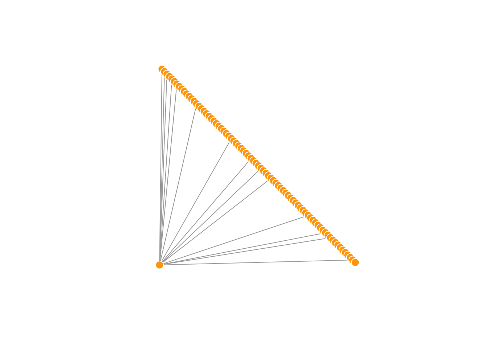{width=672}
:::

```{.r .cell-code}
# Este layout no sirve mucho...
# En todo caso, igraph trae un buen número de layouts, entre los cuales están

# vértices al azar
l <- layout_randomly(net.bg)
plot(net.bg, layout=l)
```

::: {.cell-output-display}
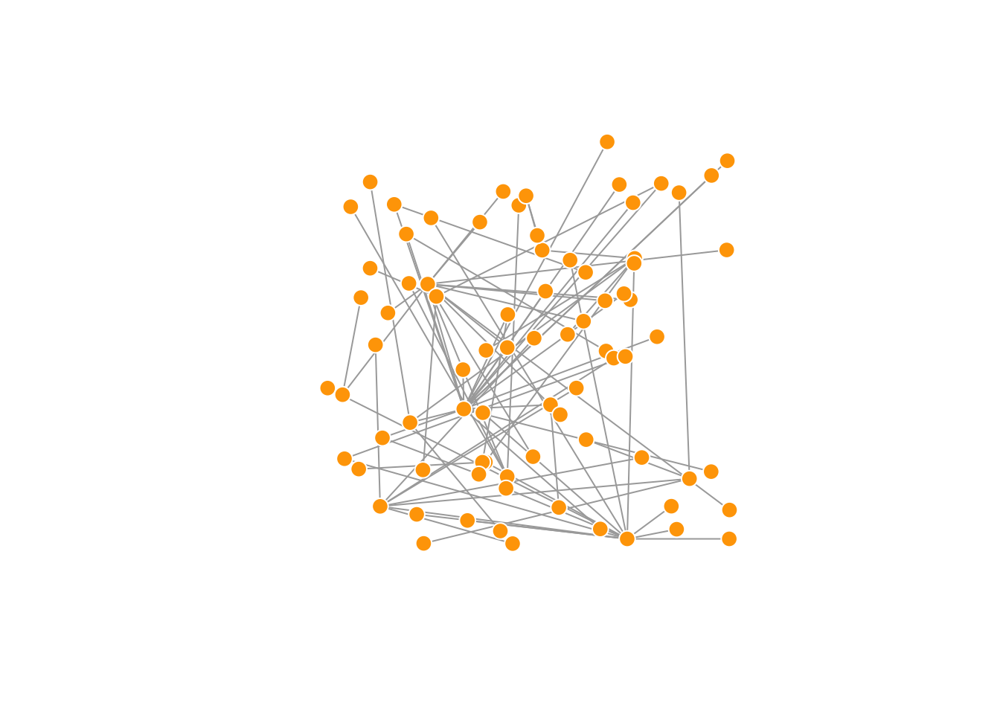{width=672}
:::
:::

::: {.cell}

```{.r .cell-code}
# layout círculo
l <- layout_in_circle(net.bg)
plot(net.bg, layout=l)
```

::: {.cell-output-display}
{width=672}
:::
:::

::: {.cell}

```{.r .cell-code}
# layout esfera 3D 
l <- layout_on_sphere(net.bg)
plot(net.bg, layout=l)
```

::: {.cell-output-display}
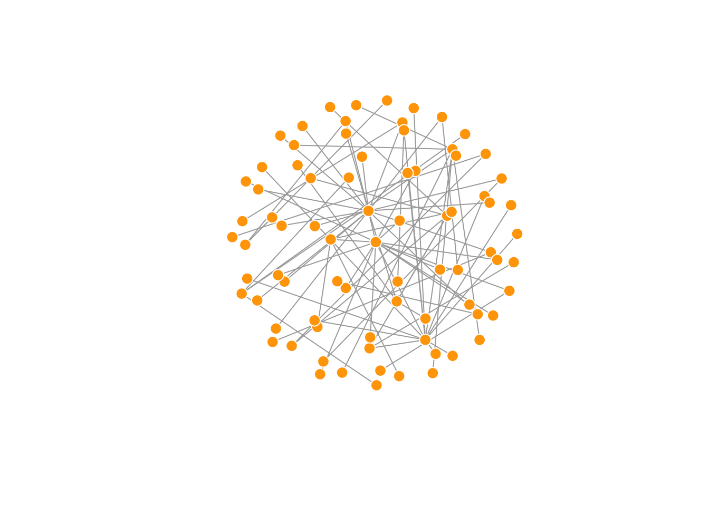{width=672}
:::
:::

::: {.cell}

```{.r .cell-code}
# Fruchterman-Reingold force-directed algorithm 
# Bueno, pero lento de computar, usualmente para grafos de no más de 1000 nodos 
l <- layout_with_fr(net.bg)
plot(net.bg, layout=l)
```

::: {.cell-output-display}
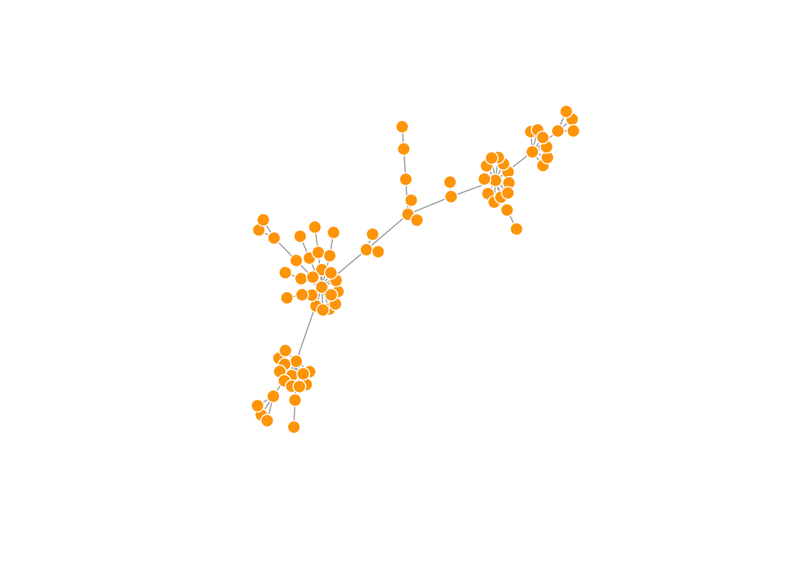{width=672}
:::
:::

::: {.cell}

```{.r .cell-code}
# Los layouts no son deterministicos: varían ligeramente cada vez que se corren. 
# Si guardamos las coordenadas l, podemos reproducir la misma figura varias veces.

par(mfrow=c(2,2), mar=c(1,1,1,1))
plot(net.bg, layout=layout_with_fr)
plot(net.bg, layout=layout_with_fr)
plot(net.bg, layout=l)
plot(net.bg, layout=l)
```

::: {.cell-output-display}
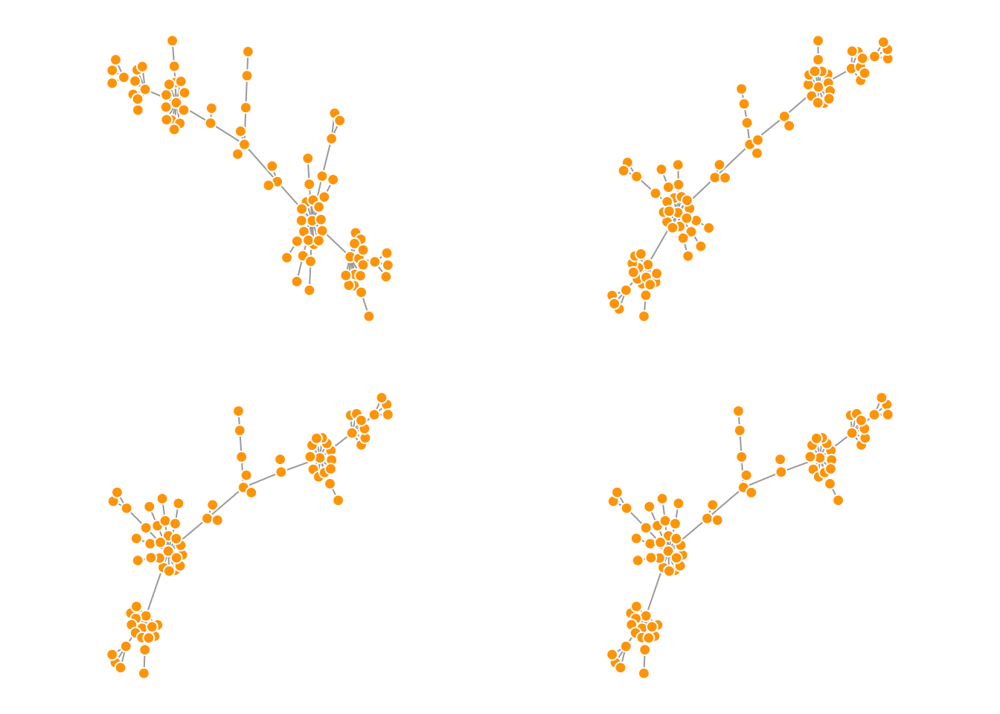{width=672}
:::

```{.r .cell-code}
dev.off()
```

::: {.cell-output .cell-output-stdout}
```
null device 
          1 
```
:::
:::

::: {.cell}

```{.r .cell-code}
# Por default, las coordenadas de los gráficos son reescaladas al intervalo [-1,1]
# para x e y. Se puede cambiar esto con el parámetro "rescale=FALSE".
# y reescalarlo manualmente multiplicando las coordenadas por un escalar. 
# Se puede usar norm_coords para normalizar el plot con los bordes que se requieran.

# Extraer las coordenadas del layout:
l <- layout_with_fr(net.bg)
# Normalizarlas para que queden en el intervalo -1, 1:
l <- norm_coords(l, ymin=-1, ymax=1, xmin=-1, xmax=1)

par(mfrow=c(2,2), mar=c(0,0,0,0))
plot(net.bg, rescale=F, layout=l*0.4)
plot(net.bg, rescale=F, layout=l*0.8)
plot(net.bg, rescale=F, layout=l*1.2)
plot(net.bg, rescale=F, layout=l*1.6)
```

::: {.cell-output-display}
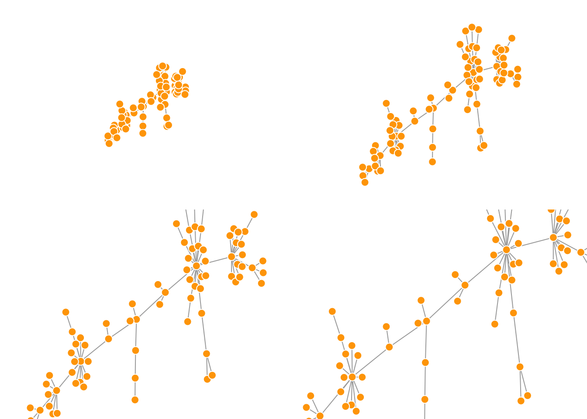{width=672}
:::

```{.r .cell-code}
dev.off()
```

::: {.cell-output .cell-output-stdout}
```
null device 
          1 
```
:::
:::

::: {.cell}

```{.r .cell-code}
# Otro algoritmo force-directed popular que da buenos resultados para grafos conectados es Kamada Kawai. Como el  Fruchterman Reingold, intenta minimizar la energía en un sistema de resortes.

l <- layout_with_kk(net.bg)
plot(net.bg, layout=l)
```

::: {.cell-output-display}
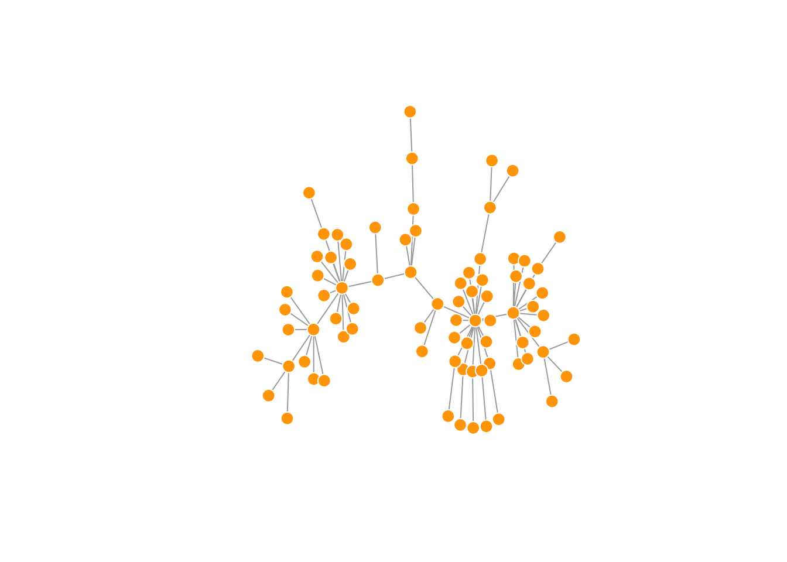{width=672}
:::
:::

::: {.cell}

```{.r .cell-code}
# El algoritmo LGL es para grafos largos conectados. Aquí se puede especificar un root - el nodo que se pondrá en el medio del layout.

plot(net.bg, layout=layout_with_lgl)
```

::: {.cell-output-display}
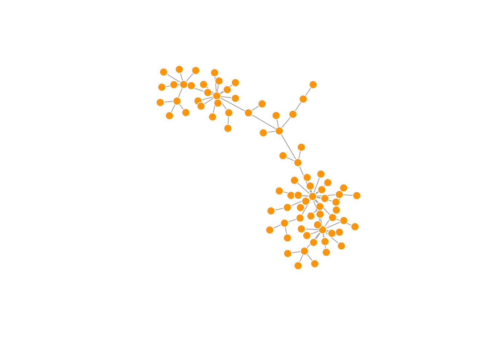{width=672}
:::
:::

::: {.cell}

```{.r .cell-code}
# Por default, igraph usa un layout llamado layout_nicely, que selecciona
# un layout apropiado basado en las propiedades del grafo.

# Chequea todos los layouts disponibles en igraph:
?igraph::layout_

layouts <- grep("^layout_", ls("package:igraph"), value=TRUE)[-1] 
# Remueve todos los layouts que no apliquen al grafo:
layouts <- layouts[!grepl("bipartite|merge|norm|sugiyama|tree", layouts)]

par(mfrow=c(3,3), mar=c(1,1,1,1))

for (layout in layouts) {
  print(layout)
  l <- do.call(layout, list(net)) 
  plot(net, edge.arrow.mode=0, layout=l, main=layout) }
```

::: {.cell-output .cell-output-stdout}
```
[1] "layout_as_star"
```
:::

::: {.cell-output .cell-output-stdout}
```
[1] "layout_components"
```
:::

::: {.cell-output .cell-output-stdout}
```
[1] "layout_in_circle"
```
:::

::: {.cell-output .cell-output-stdout}
```
[1] "layout_nicely"
```
:::

::: {.cell-output .cell-output-stdout}
```
[1] "layout_on_grid"
```
:::

::: {.cell-output .cell-output-stdout}
```
[1] "layout_on_sphere"
```
:::

::: {.cell-output .cell-output-stdout}
```
[1] "layout_randomly"
```
:::

::: {.cell-output .cell-output-stdout}
```
[1] "layout_with_dh"
```
:::

::: {.cell-output .cell-output-stdout}
```
[1] "layout_with_drl"
```
:::

::: {.cell-output-display}
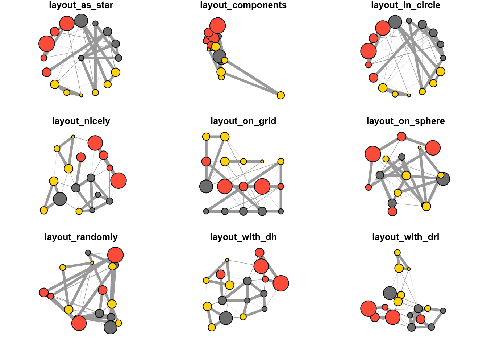{width=672}
:::

::: {.cell-output .cell-output-stdout}
```
[1] "layout_with_fr"
```
:::

::: {.cell-output .cell-output-stdout}
```
[1] "layout_with_gem"
```
:::

::: {.cell-output .cell-output-stdout}
```
[1] "layout_with_graphopt"
```
:::

::: {.cell-output .cell-output-stdout}
```
[1] "layout_with_kk"
```
:::

::: {.cell-output .cell-output-stdout}
```
[1] "layout_with_lgl"
```
:::

::: {.cell-output .cell-output-stdout}
```
[1] "layout_with_mds"
```
:::

```{.r .cell-code}
dev.off()
```

::: {.cell-output .cell-output-stdout}
```
null device 
          1 
```
:::
:::


# Redes aleatorias, de mundo pequeño y libres de escala (solo un vistazo)

Las redes aleatorias son redes en las que las conexiones entre nodos se generan aleatoriamente. Las redes aleatorias son útiles para analizar la estructura y la dinámica de las redes y, a menudo, se utilizan para modelar redes del mundo real.


::: {.cell}

```{.r .cell-code}
# Erdos-Renyi random graph 
# ('n' es el número de nodos, 'm' es el número de enlaces)
er <- sample_gnm(n=100, m=40) 
plot(er, vertex.size=6, vertex.label=NA)
```

::: {.cell-output-display}
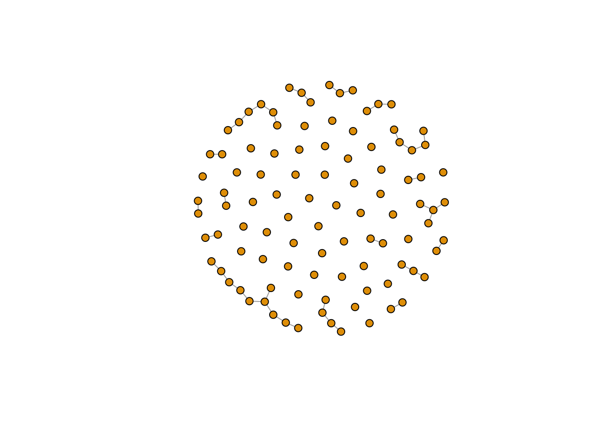{width=672}
:::
:::

::: {.cell}

```{.r .cell-code}
# Watts-Strogatz small-world graph
# Creamos un lattice con 'dim' dimensiones de 'size' nodes cada uno, y recableamos los enlaces aleatoriamente con probabilidad  'p'. Podemos permitir  'loops' y  enlaces 'multiples'.
# El neighborhood en el cual los enlaces estaban conectados es 'nei'.
sw <- sample_smallworld(dim=2, size=10, nei=1, p=0.1)
plot(sw, vertex.size=6, vertex.label=NA, layout=layout_in_circle)
```

::: {.cell-output-display}
{width=672}
:::
:::

::: {.cell}

```{.r .cell-code}
# Modelo de preferencial attachment de Barabasi-Albert preferential attachment para redes de escala libre
# 'n' es el número de nodos, 'power' es la "potencia" del attachment (1 es linear)
# 'm' es el número de enlaces añadidos en cada paso de tiempo 
 ba <-  sample_pa(n=100, power=1, m=1,  directed=F)
 plot(ba, vertex.size=6, vertex.label=NA)
```

::: {.cell-output-display}
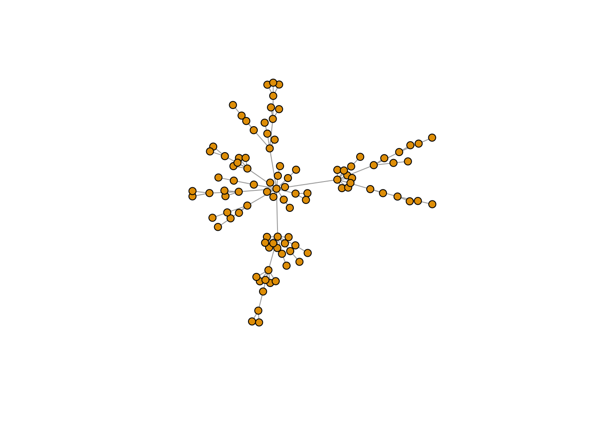{width=672}
:::
:::

::: {.cell}

```{.r .cell-code}
# También podemos llamar algunas redes clásicas: El club de Karate de Zachary
 zach <- graph("Zachary") # Zachary Karate club
 plot(zach, vertex.size=10, vertex.label=NA)
```

::: {.cell-output-display}
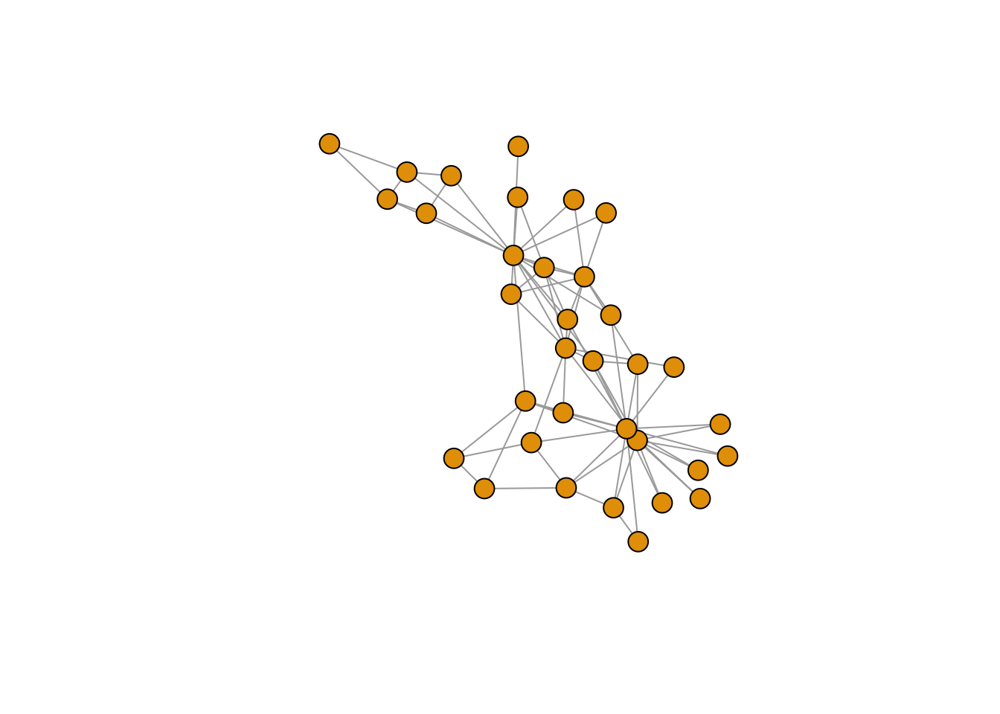{width=672}
:::
:::

::: {.cell}

```{.r .cell-code}
# Y también otros grafos con alguna característica notable. Por ejemplo, un tree

tr <- make_tree(40, children = 3, mode = "undirected")

plot(tr, vertex.size=10, vertex.label=NA) 
```

::: {.cell-output-display}
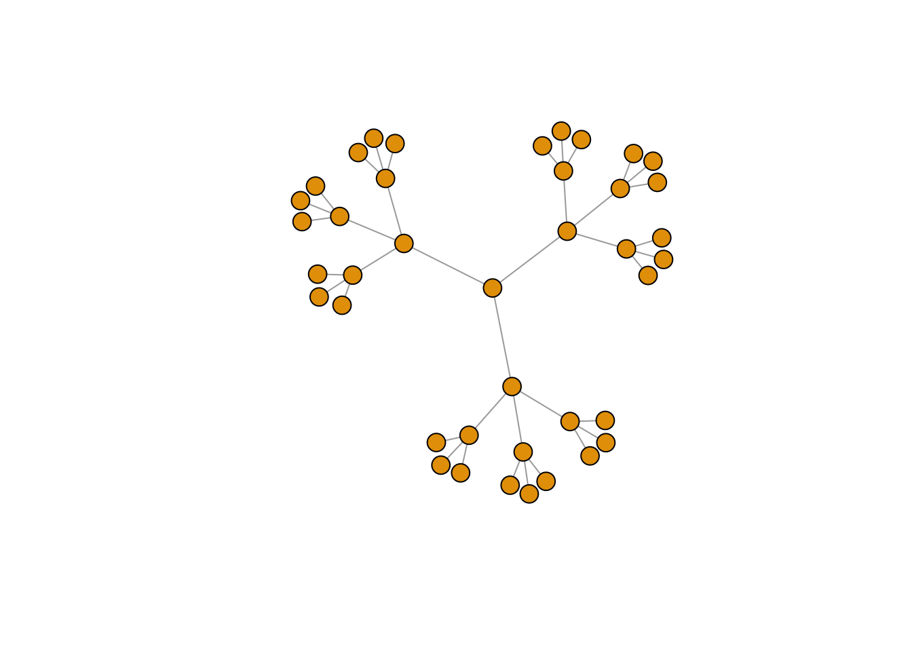{width=672}
:::
:::

::: {.cell}

```{.r .cell-code}
# O un grafo full, donde todos estén enlazados con todos

fg <- make_full_graph(40)

plot(fg, vertex.size=10, vertex.label=NA)
```

::: {.cell-output-display}
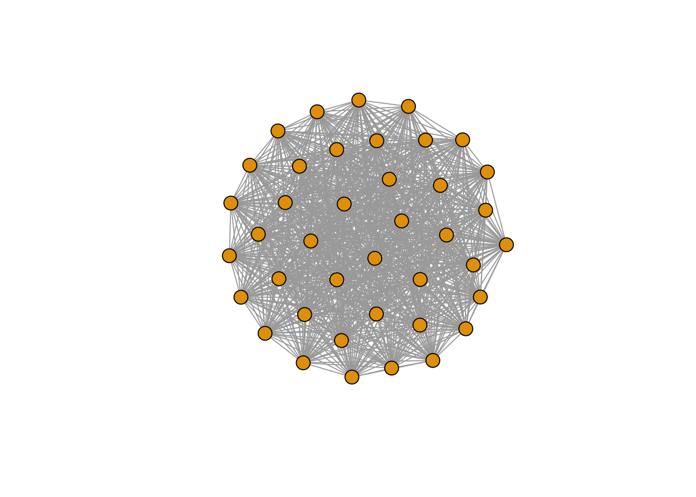{width=672}
:::
:::

::: {.cell}

```{.r .cell-code}
# "Recableando" un grafo
# creamos primero un grafo de tipo anillo:
rn <- make_ring(40)
plot(rn, vertex.size=10, vertex.label=NA)
```

::: {.cell-output-display}
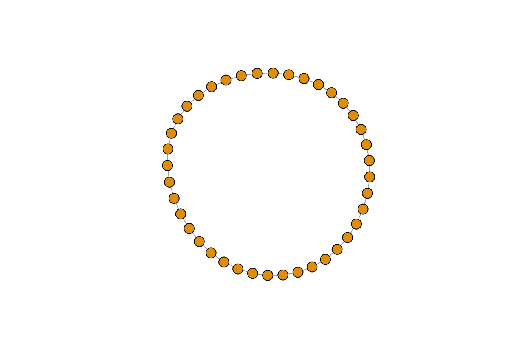{width=672}
:::
:::

::: {.cell}

```{.r .cell-code}
# 'each_edge()' es un método de rewiring que cambia el endpoint de los enlaces
 # de manera uniformemente aleatoria con una probabilidad 'prob'.
rn.rewired <- rewire(rn, each_edge(prob=0.1))
plot(rn.rewired, vertex.size=10, vertex.label=NA)
```

::: {.cell-output-display}
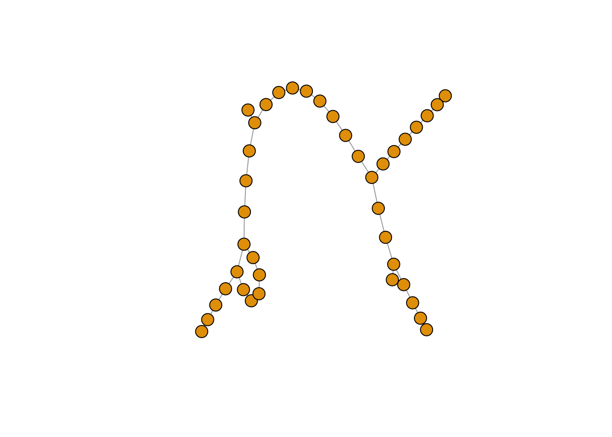{width=672}
:::
:::

::: {.cell}

```{.r .cell-code}
# Rewire para conectar los vértices a otros vértices a una cierta distancia. 
 rn.neigh = connect.neighborhood(rn, 5)
 plot(rn.neigh, vertex.size=8, vertex.label=NA)
```

::: {.cell-output-display}
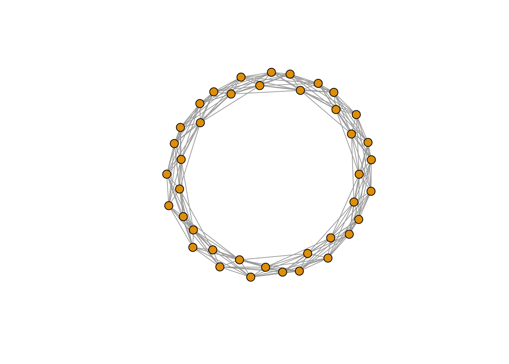{width=672}
:::
:::

::: {.cell}

```{.r .cell-code}
# Combinar grafos (uniones disjuntas, asumiendo conjuntos separados de vértices): %du%
 plot(rn, vertex.size=10, vertex.label=NA) 
```

::: {.cell-output-display}
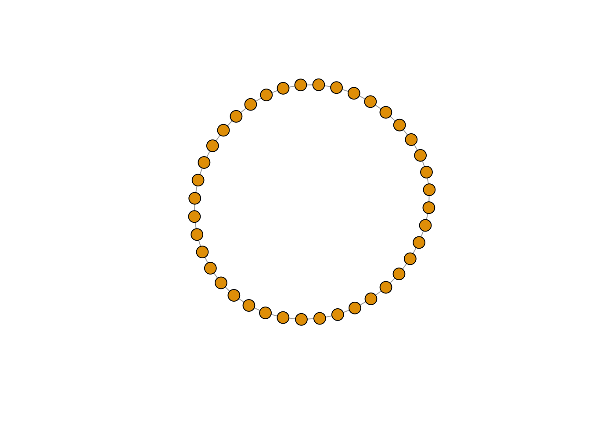{width=672}
:::

```{.r .cell-code}
 plot(tr, vertex.size=10, vertex.label=NA) 
```

::: {.cell-output-display}
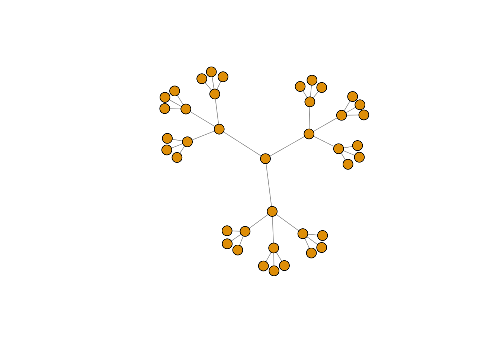{width=672}
:::

```{.r .cell-code}
 plot(rn %du% tr, vertex.size=10, vertex.label=NA) 
```

::: {.cell-output-display}
{width=672}
:::
:::


## igraphdata: exploremos algunas redes más reales

Cargamos el paquete `igraphdata`, donde vienen varios ejemplos de redes reales de distinto tipo.


::: {.cell}

```{.r .cell-code}
library(igraphdata)

help(igraphdata)
```
:::


# Redes Bipartitas

Las redes bipartitas son redes en las que los nodos se pueden dividir en dos conjuntos distintos, como personas y organizaciones en una red social o universidades y estudiantes en una red educativa. Las redes bipartitas son útiles para analizar las relaciones entre dos tipos diferentes de elementos.

## Datos de una red bipartita en una matriz: DATASET 2  

::: {.cell}

```{.r .cell-code}
library(igraph)
nodes2 <- read.csv("data/Dataset2-Media-User-Example-NODES.csv", header=T, as.is=T)
links2 <- read.csv("data/Dataset2-Media-User-Example-EDGES.csv", header=T, row.names=1)

# Examinamos la data
head(nodes2)
```

::: {.cell-output .cell-output-stdout}
```
   id   media media.type media.name audience.size
1 s01     NYT          1  Newspaper            20
2 s02    WaPo          1  Newspaper            25
3 s03     WSJ          1  Newspaper            30
4 s04    USAT          1  Newspaper            32
5 s05 LATimes          1  Newspaper            20
6 s06     CNN          2         TV            56
```
:::

```{.r .cell-code}
head(links2)
```

::: {.cell-output .cell-output-stdout}
```
    U01 U02 U03 U04 U05 U06 U07 U08 U09 U10 U11 U12 U13 U14 U15 U16 U17 U18 U19
s01   1   1   1   0   0   0   0   0   0   0   0   0   0   0   0   0   0   0   0
s02   0   0   0   1   1   0   0   0   0   0   0   0   0   0   0   0   0   0   0
s03   0   0   0   0   0   1   1   1   1   0   0   0   0   0   0   0   0   0   0
s04   0   0   0   0   0   0   0   0   1   1   1   0   0   0   0   0   0   0   0
s05   0   0   0   0   0   0   0   0   0   0   1   1   1   0   0   0   0   0   0
s06   0   0   0   0   0   0   0   0   0   0   0   0   1   1   0   0   1   0   0
    U20
s01   0
s02   1
s03   0
s04   0
s05   0
s06   0
```
:::
:::

::: {.cell}

```{.r .cell-code}
# links2 es la matriz de incidencia para una two-mode network:
links2 <- as.matrix(links2)
dim(links2)
```

::: {.cell-output .cell-output-stdout}
```
[1] 10 20
```
:::

```{.r .cell-code}
dim(nodes2)
```

::: {.cell-output .cell-output-stdout}
```
[1] 30  5
```
:::
:::

::: {.cell}

```{.r .cell-code}
net2 <- graph_from_incidence_matrix(links2)

# Un atributo de los vértices 'type' muestra a qué modo/tipo pertenece cada vértice.
table(V(net2)$type)
```

::: {.cell-output .cell-output-stdout}
```

FALSE  TRUE 
   10    20 
```
:::
:::

::: {.cell}

```{.r .cell-code}
plot(net2,vertex.label=NA)
```

::: {.cell-output-display}
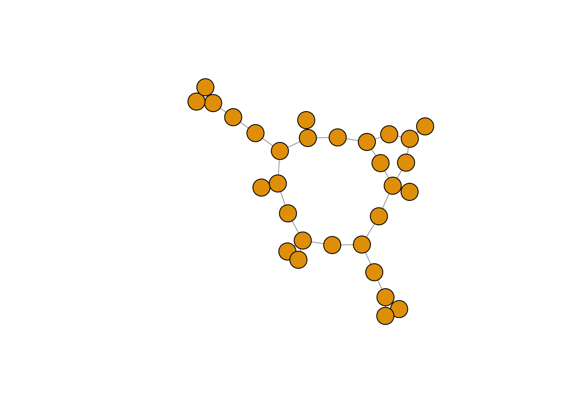{width=672}
:::
:::

::: {.cell}

```{.r .cell-code}
# Para transformar una matriz de una red de un modo a un objeto de igraph, podemos usar la función
# graph_from_adjacency_matrix()
# También podemos generar fácilmente las proyecciones bipartitas para redes de dos modos:
# (Las Co-membresías son fáciles de calcular, multiplicando la matriz de la red por su traspuesta, o usando la función de igraph `bipartite.projection`)

net2.bp <- bipartite.projection(net2)
```
:::

::: {.cell}

```{.r .cell-code}
# Se pueden calcular las proyecciones de manera manual también:
#   as_incidence_matrix(net2)  %*% t(as_incidence_matrix(net2))
# t(as_incidence_matrix(net2)) %*%   as_incidence_matrix(net2)
```
:::

::: {.cell}

```{.r .cell-code}
plot(net2.bp$proj1, vertex.label.color="black", vertex.label.dist=1,
     vertex.label=nodes2$media[!is.na(nodes2$media.type)])
```

::: {.cell-output-display}
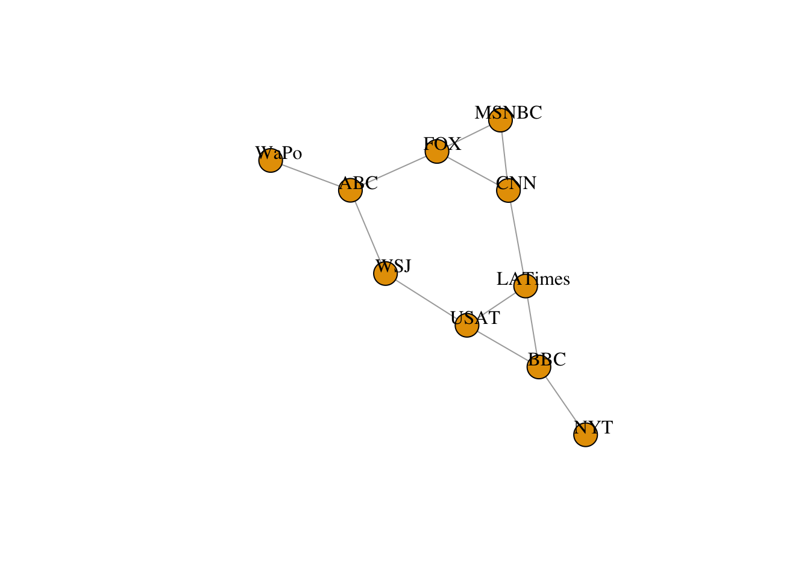{width=672}
:::
:::

::: {.cell}

```{.r .cell-code}
plot(net2.bp$proj2, vertex.label.color="black", vertex.label.dist=1,
     vertex.label=nodes2$media[ is.na(nodes2$media.type)])
```

::: {.cell-output-display}
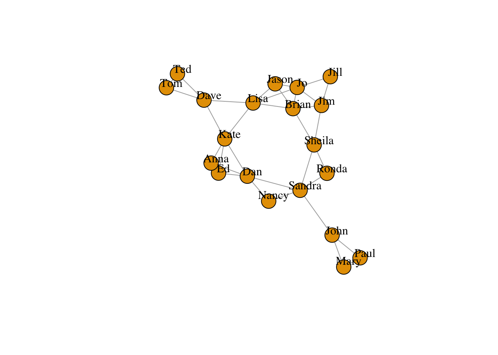{width=672}
:::
:::


# Ejemplo extendido: Flavor Network and the Principles of Food Pairing.

El paper "Flavor Network and the Principles of Food Pairing" aplica la ciencia de redes y otras técnicas de análisis de datos para construir una red de sabores a partir de una gran base de datos de recetas. Específicamente, los autores construyen una red dirigida y ponderada en la que los nodos representan ingredientes individuales y los bordes representan el grado en que los ingredientes se usan juntos en las recetas. Luego, los autores analizan la red para identificar los principios subyacentes al maridaje de alimentos.

Los principales métodos utilizados en esta investigación incluyen la minería de datos y el análisis de redes. Los autores extraen una gran base de datos de recetas para obtener los ingredientes utilizados en cada receta y el grado en que se utilizan juntos. Estos datos se utilizan luego para construir la red de sabor. Luego se emplean técnicas de análisis de redes para identificar los patrones de combinaciones de ingredientes y los principios que los sustentan.

Los principales resultados de esta investigación incluyen la identificación de cuatro principios de maridaje de alimentos. Estos principios son emparejamientos complementarios (p. ej., sweet-sour), compartir ingredientes (p. ej., huevos y leche), ingredientes puente (p. ej., cebollas) y afinidades de sabor (p. ej., ajo y albahaca). Los autores también identificaron una serie de ingredientes específicos que se usan comúnmente para unir diferentes perfiles de sabor.

Los conceptos de ciencia de redes aplicados en esta investigación incluyen el análisis de topología de red y redes ponderadas. Los autores analizan la topología de la red para identificar los patrones de emparejamiento de ingredientes y los principios que los sustentan. También analizan la red ponderada para identificar los ingredientes que comúnmente se usan juntos.


# Leer datos

Los datos de Flavor Network están disponibles en el sitio web http://www.nature.com/articles/srep00196#data. Este conjunto de datos contiene una lista de ingredientes y sus compuestos de sabor asociados.


::: {.cell}

```{.r .cell-code}
# leemos los datos descargados

edgelist_net_1= read.csv(file = "data/srep00196-s2.csv",skip = 4, header = F)
edgelist_net_2 = read.csv(file = "data/srep00196-s3.csv",skip = 4, header = F)
```
:::

¿Qué son estas redes?
¿Son los datos "crudos", o los datos ya procesados?


::: {.cell}

:::
